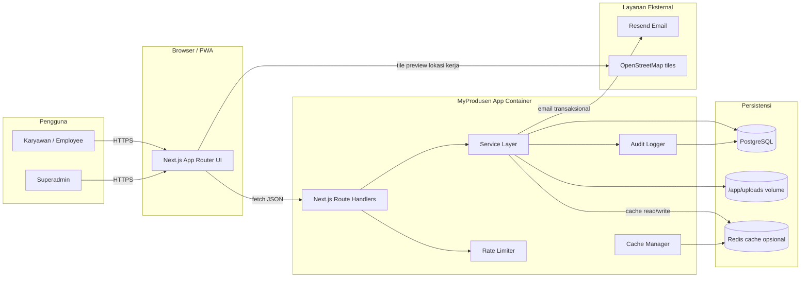
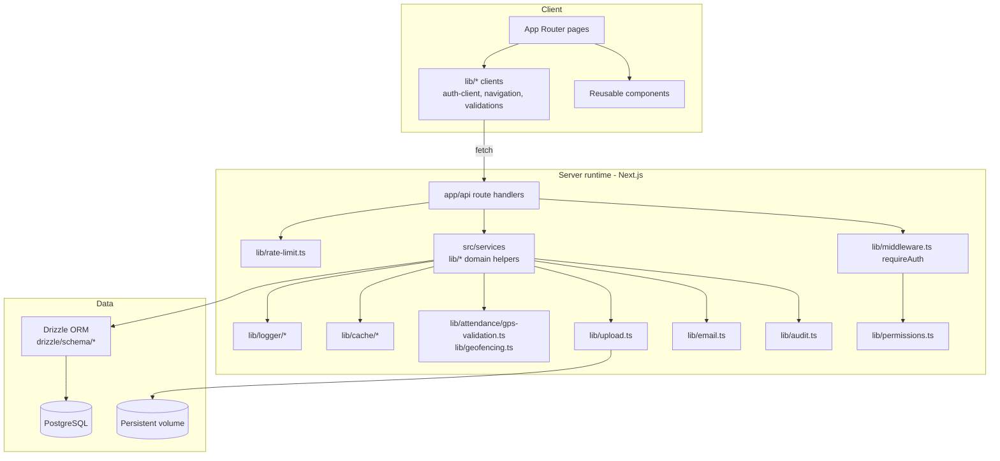
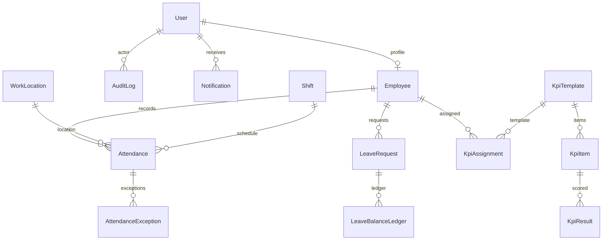
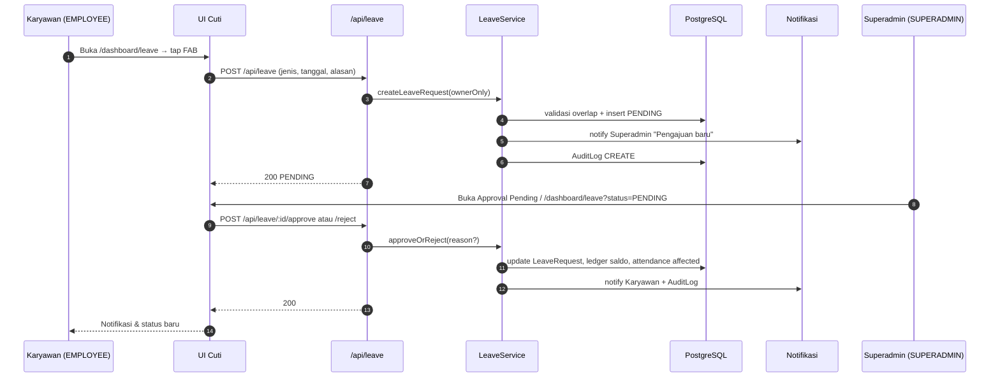
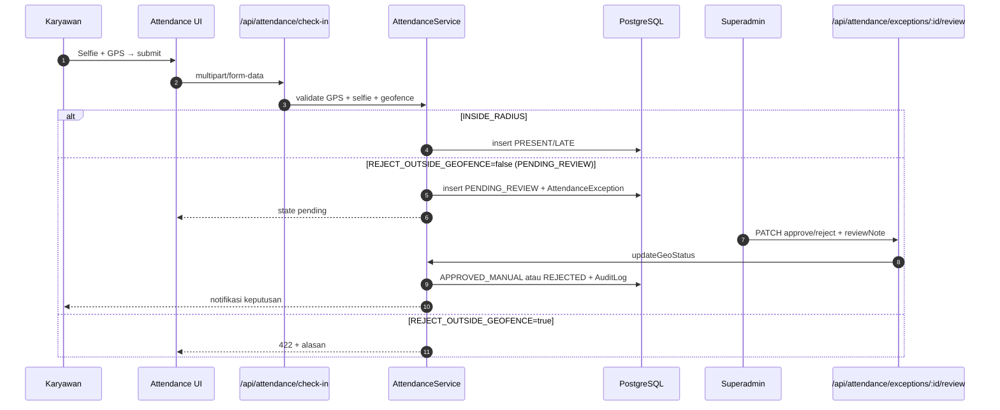
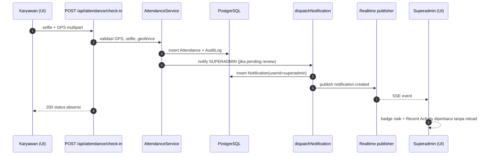
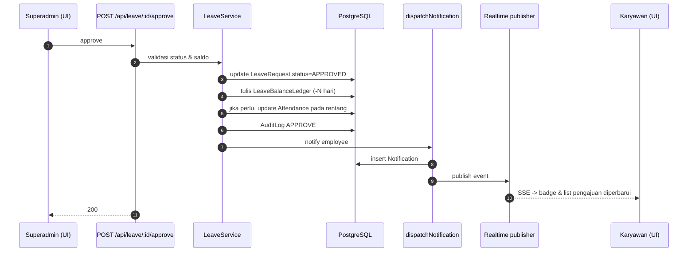

# DESIGN — MyProdusen Web App

> **Role lock.** MyProdusen production uses exactly two account roles:
> `SUPERADMIN` dan `EMPLOYEE`. `ADMIN_HR` dan `SUPERVISOR` adalah nilai
> enum database historis dan tidak boleh diberi akses route, navigasi,
> atau seed produksi baru.

| Field | Value |
| ----- | ----- |
| Project | MyProdusen HRIS & Employee Operations |
| Client | Produsen Dimsum Medan |
| Group | TBM Group |
| Status | Canonical project-wide design document |
| Owner of decisions | Product owner + Superadmin operator |
| Last reviewed | 2026-05-20 |

## 1. Tujuan dokumen

Dokumen ini menjelaskan desain seluruh sistem MyProdusen di tingkat
arsitektur dan modul, sehingga setiap engineer/agent dapat:

- Memahami batas tanggung jawab tiap modul.
- Mengubah satu modul tanpa merusak modul lain.
- Menambahkan fitur baru tanpa melanggar RBAC, brand, atau keamanan.
- Menyambungkan implementasi nyata (`app/`, `lib/`, `src/`, `drizzle/`)
  dengan kontrak produk di `/docs/prd/README.md`.

Dokumen ini tidak menggantikan dokumen lain. Hubungannya:

| Dokumen | Fokus |
| ------- | ----- |
| `docs/prd/README.md` | Apa yang dibangun, untuk siapa, alur bisnis. |
| `docs/architecture/README.md` | Stack pilihan, request flow ringkas, batasan stack. |
| `docs/security/README.md` | RBAC, audit, file selfie, JWT, hardening. |
| `docs/database/README.md` | Skema tabel, indeks, migrasi. |
| `docs/deployment/README.md` | Docker, Coolify, env, runbook deploy. |
| `docs/operations/README.md` | SOP harian, runbook, backup/restore. |
| `docs/testing-qa/README.md` | Strategi pengujian dan release gate. |
| `docs/ui-ux-guide/README.md` | Token brand, layout, copy. |
| `docs/references/*` | Kontrak visual: screenshots dan email guide. |
| **`docs/DESIGN.md` (file ini)** | Bagaimana semua bagian itu dirakit menjadi sistem. |

Jika dokumen ini bertentangan dengan PRD, Security, atau Database,
**dokumen sumber tersebut yang menang**, dan dokumen ini wajib
disesuaikan, bukan sebaliknya.

## 2. Sasaran desain

### 2.1 Sasaran fungsional

1. Operasi HR harian (kehadiran, cuti, KPI, laporan) dijalankan dari
   satu sistem terpusat dengan data yang akurat.
2. Karyawan hanya melihat datanya sendiri; Superadmin melihat seluruh
   organisasi.
3. Kehadiran dapat diverifikasi: GPS, geo-fencing, selfie realtime, dan
   metadata perangkat semuanya tercatat.
4. Pengajuan (cuti/sakit/izin/koreksi absensi) memiliki alur approval
   yang ditegakkan server-side.
5. Semua aksi sensitif tercatat di audit log.
6. Notifikasi tersinkron ke pusat notifikasi UI dan opsional ke channel
   realtime.

### 2.2 Sasaran non-fungsional

1. Mobile-first: layar 320 px tidak boleh horizontal-scroll.
2. Keamanan default: backend mengambil keputusan; frontend hanya UX.
3. Operability: build deterministik, healthcheck stabil, env tervalidasi.
4. Reversibility: tidak ada tindakan destruktif tanpa konfirmasi atau
   audit.
5. Mudah dirawat oleh tim kecil: kode modular, dependency minim, dan
   konvensi konsisten.

### 2.3 Bukan sasaran (out of scope MVP)

- SaaS multi-tenant. Sistem ini single-tenant untuk Produsen Dimsum
  Medan.
- Integrasi pihak ketiga di luar email (Resend) dan tile peta OSM.
- Aplikasi native iOS/Android; cukup PWA + web responsive.
- Anonim/landing publik bermarketing.

## 3. Konteks sistem



Aktor utama:

- **Karyawan / Employee.** Mengakses sistem dari HP. Aksi inti:
  check-in/check-out, ajukan cuti, lihat KPI, payroll pribadi.
- **Superadmin.** Operator lengkap. Mengelola akun, lokasi, shift,
  approval, KPI, laporan, audit, dan konfigurasi.
- **Resend.** Pengirim email transaksional (aktivasi, reset password,
  notifikasi penting).
- **OpenStreetMap.** Sumber tile peta read-only untuk preview lokasi
  kerja. Tidak ada data karyawan yang dikirim ke OSM.

Di luar lingkup integrasi: HRIS pihak ketiga, payroll vendor eksternal,
SSO eksternal.

## 4. Arsitektur tingkat tinggi



Rangkuman aturan:

- Route handler tipis. Wajib panggil `requireAuth` lalu delegasi ke
  service.
- Service adalah pemilik aturan bisnis. Service tidak boleh menyentuh
  HTTP atau React.
- Repository/query memakai Drizzle. Tidak ada raw SQL kecuali untuk
  agregasi dashboard yang sudah diuji.
- Audit log dipanggil eksplisit oleh service untuk aksi sensitif.
- File selfie hanya boleh dilayani lewat route terproteksi
  (`/api/attendances/:id/selfie/...`).

## 5. Organisasi kode

Struktur direktori produksi:

```txt
/app
  page.tsx                  # landing publik (mobile-first)
  layout.tsx                # root layout, font, PWA boot
  login/                    # /login
  register/                 # /register
  forgot-password/          # /forgot-password
  reset-password/           # /reset-password
  activate-account/         # /activate-account
  dashboard/                # area login-only
    layout.tsx              # bottom nav / sidebar role-aware
    page.tsx                # Beranda role-aware
    attendance/             # check-in/out + history + exception
    leave/                  # cuti & izin
    kpi/                    # KPI list & template
    employees/              # CRUD karyawan (Superadmin)
    locations/              # CRUD work location (Superadmin)
    shifts/                 # CRUD shift (Superadmin)
    users/                  # akun & role (Superadmin)
    payroll/                # payroll & slip
    overtime/               # lembur
    documents/              # dokumen perusahaan
    notifications/          # pusat notifikasi
    audit/                  # audit log (Superadmin)
    profile/                # profil & ubah password & logout
    reports/                # laporan + PDF + ekspor

  api/
    auth/                   # login, register, activate, reset, profile
    dashboard/               # stats, heatmap
    attendance/              # check-in, check-out, exceptions
    attendances/[id]/selfie/ # protected selfie viewer
    employees/               # CRUD karyawan
    work-locations/          # CRUD lokasi
    shifts/                  # CRUD shift
    leave/                   # pengajuan & approval
    kpi/                     # template, assignment, result, approve
    payroll/                 # periode, run, slip, ekspor
    overtime/                # rate, request, approve
    notifications/           # list, mark as read
    reports/                 # csv, pdf, summary
    audit/                   # baca audit log
    health/, version/        # ops
    realtime/                # SSE/poll endpoint untuk notifikasi

/lib
  auth.ts, middleware.ts     # JWT helper + requireAuth
  permissions.ts             # cek role + path policy
  audit.ts                   # tulis audit log
  upload.ts                  # validasi & simpan file
  email.ts                   # transactional email (Resend)
  geofencing.ts              # haversine + helpers
  rate-limit.ts              # per-IP + per-user limiter
  attendance/gps-validation.ts
  cache/*                    # cache manager + keys + strategies
  navigation/role-navigation.ts
  payroll/, leave/, kpi/, reports/, notifications/, overtime/
  forms/                     # zod schemas yang dipakai server+UI

/src
  components/                # UI reusable: ui/Modal, layout/Sidebar, dll
  services/                  # service layer fitur (attendance, kpi, dll)
  hooks/                     # React hooks domain
  context/                   # React context kecil (toast)
  api/                       # adapter client opsional
  utils/                     # util sederhana
  data/                      # data konstanta (mis. divisi, role label)

/drizzle
  schema/*                   # tabel + enum
  migrations/*               # SQL migrations
  seed.ts                    # seed minimal SUPERADMIN

/docs
  prd/, architecture/, security/, database/, deployment/, operations/,
  testing-qa/, ui-ux-guide/, references/
  DESIGN.md  <-- file ini

/scripts
  run-migrations.mjs, build-next-with-heartbeat.mjs,
  check-production-env.mjs, check-references.mjs,
  bootstrap-superadmin.mjs

/tests
  rbac/, api/, dashboard/, db/, email/, e2e/, scripts/
```

Aturan pemetaan singkat:

- Kode UI baru → `app/dashboard/<modul>/page.tsx` + `src/components/...`.
- API baru → `app/api/<modul>/route.ts` + service di `src/services` atau
  `lib/<modul>/...`.
- Validasi input → `lib/forms/*` (Zod) sehingga dapat dipakai bersama.
- Skema DB baru → tambah file di `drizzle/schema/`, generate migration
  baru, jangan reset.

## 6. Desain modul

Setiap subbab mengikuti kerangka: **Tujuan → Komponen utama →
Antarmuka publik → Aturan bisnis kritis → Risiko & mitigasi**.

### 6.1 Auth & aktivasi akun

- **Tujuan.** Akun login aman, terverifikasi, dan reset-password
  konsisten.
- **Komponen.** `lib/auth.ts` (JWT), `lib/middleware.ts` (requireAuth),
  `lib/email.ts` (template), `app/api/auth/*`.
- **Antarmuka.**
  - `POST /api/auth/login` → set httpOnly cookie sesi.
  - `POST /api/auth/public-register` → buat user `EMPLOYEE` `isActive=false`
    dan kirim email aktivasi (token JWT purpose `account-activation`,
    24 jam).
  - `POST /api/auth/activate` → set `isActive=true`.
  - `POST /api/auth/forgot-password` → email reset (token 30 menit).
  - `POST /api/auth/reset-password` → ganti password + email konfirmasi.
  - `POST /api/auth/logout` → hapus cookie sesi.
- **Aturan bisnis.**
  - User inactive tidak dapat login.
  - Password disimpan dengan bcrypt; policy: minimal 8 karakter, huruf
    besar/kecil, angka, simbol.
  - JWT secret hanya boleh dibaca via `getProductionJwtSecret()`. Build
    produksi gagal jika `JWT_SECRET` < 32 karakter.
  - Origin/Referer guard di `lib/core/route-handler.ts` untuk semua
    request mutating cookie-auth.
- **Risiko.** Brute-force login. **Mitigasi.** Rate limit per IP+username
  (5 attempt / 15 menit) di `lib/rate-limit.ts`.

### 6.2 User management

- **Tujuan.** Superadmin mengelola siapa yang bisa login, dengan role
  apa, dan apakah aktif.
- **Komponen.** `app/dashboard/users/page.tsx`, `app/api/users/*`,
  `lib/permissions.ts`.
- **Antarmuka.**
  - `GET /api/users` → daftar (Superadmin).
  - `PATCH /api/users/:id/role` → ubah role.
  - `PATCH /api/users/:id/employee-profile` → tautkan ke entity
    `Employee`.
- **Aturan.**
  - Hanya `SUPERADMIN` yang dapat mengubah role.
  - Membuat akun Superadmin baru dilakukan via skrip seed atau
    `bootstrap-superadmin.mjs`, tidak via UI publik.
  - Role change → kirim email `role-changed` + tulis audit log.
  - User inactive otomatis kehilangan akses pada permintaan berikutnya.
- **Risiko.** Privilege escalation lewat client tampering. **Mitigasi.**
  Otorisasi server-side di setiap PATCH; ignore role di payload.

### 6.3 Employee management & NIP

- **Tujuan.** Setiap karyawan punya identitas tetap (NIP) dan profil HR.
- **Komponen.** `app/dashboard/employees/*`, `app/api/employees/*`,
  `lib/employee/*`, `drizzle/schema/employee.ts`.
- **Format NIP.**
  ```txt
  MPD-{YEAR}-{DIVISION_CODE}-{SEQUENCE}
  ```
  contoh `MPD-2026-PRD-0001`.
- **Aturan.**
  - NIP unik di database (constraint).
  - NIP tidak pernah dipakai ulang; deaktivasi tidak melepas NIP.
  - Generator NIP collision-safe: di-wrap transaction + retry.
  - Karyawan yang punya histori (absensi/cuti/KPI/payroll) tidak boleh
    hard-delete; gunakan status `INACTIVE` atau `RESIGNED`.
- **Risiko.** Race condition saat generate NIP paralel. **Mitigasi.**
  Sequence ditarik dengan `SELECT ... FOR UPDATE` atau retry dengan
  unique constraint sebagai backstop.

### 6.4 Work location & geo-fencing

- **Tujuan.** Mendefinisikan tempat kerja resmi dan radius valid untuk
  absensi.
- **Komponen.** `app/dashboard/locations/page.tsx`, `WorkLocationMap`
  (`src/components/locations/WorkLocationMap.tsx`),
  `lib/geofencing.ts`, `lib/maps/osm-tile-math.ts`.
- **Field.** `name`, `address`, `latitude`, `longitude`,
  `radius` (10–1000 m), `isActive`.
- **Aturan.**
  - Hanya Superadmin yang dapat CRUD.
  - Validasi sisi server: lat ∈ [-90, 90], lon ∈ [-180, 180],
    radius ∈ [10, 1000].
  - Perubahan tidak boleh merusak attendance lama. Attendance menyimpan
    snapshot path/coordinate sendiri.
  - Setiap CRUD menulis audit log.
- **Frontend.** Card grid `minmax(min(100%, 340px), 1fr)` agar aman di
  320 px. Preview peta OSM dengan SVG circle untuk radius. Modal
  create/edit memakai konfirmasi delete in-app, **bukan** `confirm()`.

### 6.5 Shift management

- **Tujuan.** Mengatur jam kerja standar dan toleransi.
- **Komponen.** `app/dashboard/shifts/*`, `lib/forms/shift.ts`.
- **Field.** `name`, `startTime`, `endTime`, `lateToleranceMinutes`,
  `checkinOpenMinutesBefore`, `checkoutCloseMinutesAfter`, `isActive`.
- **Aturan.**
  - Karyawan punya `defaultShiftId`. Attendance menyimpan
    `shiftSnapshot` opsional.
  - Edit shift tidak retroaktif terhadap attendance yang sudah tercatat.

### 6.6 Attendance — GPS + selfie + exceptions

- **Tujuan.** Memvalidasi kehadiran dengan bukti yang dapat diaudit.
- **Komponen.**
  - UI: `app/dashboard/attendance/page.tsx`,
    `RealtimeSelfieCamera`, `MyExceptionPanel`, `SelfieViewer`.
  - API: `app/api/attendance/check-in/route.ts`,
    `app/api/attendance/check-out/route.ts`,
    `app/api/attendance/exceptions/route.ts`,
    `app/api/attendances/[id]/selfie/check-in/route.ts`,
    `app/api/attendances/[id]/selfie/check-out/route.ts`.
  - Server: `src/services/attendance/attendance.service.ts`,
    `lib/attendance/gps-validation.ts`, `lib/upload.ts`,
    `lib/geofencing.ts`.
- **Alur check-in.**
  1. UI minta izin kamera + GPS.
  2. UI ambil selfie realtime → `Blob`. Tidak ada `<input type="file">`.
  3. UI POST `multipart/form-data` ke `/api/attendance/check-in`.
  4. `requireAuth` → ambil employee + work location aktif.
  5. `validateGpsPayload`: lat/lon valid, accuracy ≤
     `GPS_MAX_ACCURACY_METERS`, timestamp ≤
     `GPS_TIMESTAMP_MAX_AGE_SECONDS`.
  6. `lib/upload.ts` validasi MIME, ukuran, dan rename file safe.
  7. `lib/geofencing.ts` hitung Haversine. Bandingkan dengan
     `WorkLocation.radius`.
  8. Putuskan `checkInGeoStatus`: `INSIDE_RADIUS`, `PENDING_REVIEW`, atau
     `REJECTED` berdasarkan `REJECT_OUTSIDE_GEOFENCE`.
  9. Insert `Attendance` + metadata + audit log + notifikasi sesuai.
- **Aturan kunci.**
  - Satu check-in per karyawan per tanggal.
  - Tidak boleh check-out tanpa check-in.
  - Tidak boleh double check-out.
  - Selfie wajib di kedua sisi.
  - GPS disabled / accuracy buruk → reject.
  - Manual adjustment (Superadmin) wajib reason ≥ 5 karakter dan tulis
    audit log.
- **Exceptions.** Setiap penolakan / pending masuk
  `AttendanceException`. Superadmin mereview di
  `/dashboard/attendance/exceptions` dengan filter status, search, dan
  paginasi. Catatan review per row, **tidak** di-share antar row.
- **Risiko.** Ekspos selfie publik. **Mitigasi.** File disimpan di
  `/app/uploads/attendance-selfies/...`, dilayani via route terproteksi
  dengan path traversal guard (`^[A-Za-z0-9_-]+$`) dan
  `Cache-Control: no-store, private`.

### 6.7 Leave / sick / permission

- **Tujuan.** Workflow approval untuk pengajuan ketidakhadiran.
- **Komponen.** `app/dashboard/leave/*`, `app/api/leave/*`,
  `lib/leave/*`, `LeaveBalanceLedger` di Drizzle.
- **Tipe.** `LEAVE`, `SICK`, `PERMISSION`.
- **Aturan.**
  - Karyawan hanya bisa membuat untuk dirinya sendiri.
  - Sistem menolak pengajuan yang overlap dengan request aktif.
  - Pending → Superadmin approve atau reject.
  - Reject wajib alasan ≥ 10 karakter.
  - Approve memutakhirkan ledger saldo cuti dan status absensi pada
    rentang tanggal terkait.
  - Setiap aksi → notifikasi pemohon + audit log.
- **UI.** Tombol Approve/Reject di modal Detail hanya tampil untuk
  `SUPERADMIN`. Backend tetap menjadi penentu.

### 6.8 KPI

- **Tujuan.** Mengukur performa karyawan dengan template terstandar.
- **Komponen.** `app/dashboard/kpi/*`, `app/api/kpi/*`, `lib/kpi/*`.
- **Konsep.** `KpiTemplate` → `KpiItem[]` → `KpiAssignment` per
  karyawan/period → `KpiResult` per item.
- **Metode skor.** `higher_is_better`, `lower_is_better`, `boolean`.
- **Aturan.**
  - Total `weight` template idealnya 100. Validasi memberi peringatan
    jika tidak.
  - Karyawan hanya melihat KPI miliknya.
  - Karyawan tidak boleh mengubah skor.
  - KPI yang sudah `isApproved=true` hanya boleh diubah oleh role
    authorized dengan reason; perubahan menulis audit log.
- **Risiko.** Distribusi bobot salah. **Mitigasi.** Validator template
  menolak total weight > 100 atau item tanpa unit/method.

### 6.9 Notifications

- **Tujuan.** Memberitahu pengguna tentang kejadian penting.
- **Komponen.** `lib/notifications/*`, `app/api/notifications/*`,
  `app/dashboard/notifications/page.tsx`,
  `app/api/realtime/route.ts` (best-effort).
- **Aturan.**
  - Notifikasi disimpan di tabel `Notification` (per user).
  - Realtime publish bersifat best-effort; kegagalan tidak boleh
    membatalkan mutation aslinya.
  - Pengguna hanya bisa membaca notifikasinya sendiri dan menandai
    sebagai read.

### 6.10 Audit log

- **Tujuan.** Trail tindakan sensitif yang tidak dapat diubah pengguna
  biasa.
- **Komponen.** `lib/audit.ts`, `drizzle/schema/audit.ts`,
  `app/api/audit/*`, `app/dashboard/audit/page.tsx`.
- **Field.** `actorUserId`, `action`, `targetType`, `targetId`,
  `oldValueJson`, `newValueJson`, `ipAddress`, `userAgent`, `createdAt`.
- **Aksi tercatat.** Lihat `docs/security/README.md` untuk daftar
  lengkap (login, check-in, leave approve, role change, export, dll).
- **Aturan.**
  - Audit log read-only untuk non-Superadmin.
  - Mutation kegagalan tidak boleh membuat audit log palsu, namun
    `LOGIN_FAILED` dan `CHECK_IN_FAILED` tetap dicatat untuk
    investigasi.

### 6.11 Reports & export

- **Tujuan.** Memberi data agregat dan ekspor ke pengguna yang
  berwenang.
- **Komponen.** `app/dashboard/reports/*`, `app/api/reports/*`,
  `lib/reports/*`.
- **Output.** CSV (wajib), PDF (Superadmin only), Excel (opsional).
- **Aturan.**
  - Filter wajib: rentang tanggal, divisi, lokasi, status, employee.
  - Setiap ekspor menulis audit log `EXPORT`.
  - PDF route memakai `Cache-Control: no-store, no-cache, must-revalidate, private`
    dan membatasi rentang via `PDF_REPORT_MAX_DATE_RANGE_MONTHS` serta
    baris via `PDF_REPORT_MAX_ROWS`.
  - Ekspor tidak pernah membongkar path/binary selfie. Hanya bendera
    "ada/tidak".

### 6.12 Payroll & overtime

- **Status.** Aktif jika sudah ada di kode (`app/api/payroll/*`,
  `app/api/overtime/*`). Modul lain (reimbursement, documents,
  announcements, offline sync) mengikuti status di repo.
- **Aturan.**
  - Endpoint payroll memakai `no-store` dan otorisasi server-side.
  - Karyawan hanya melihat slip/payroll-nya sendiri.
  - Superadmin yang menjalankan run, lock, unlock, approve, paid,
    export.
  - Data BPJS/pajak/bank dianggap PII; tidak boleh masuk log umum.

### 6.13 Dashboard

- **Tujuan.** Memberi ringkasan harian yang role-aware.
- **EMPLOYEE Beranda** (`screens/employee-full-ui-ux-mobile.png`).
  Yellow greeting card + 4 metric cards (Hadir/Izin/Cuti/Sakit) + 7-day
  attendance bar chart + Lokasi Kerja card + Riwayat Kehadiran 5
  terakhir. Tidak menampilkan total organisasi atau angka lintas
  karyawan.
- **SUPERADMIN Beranda**
  (`screens/super-admin-full-ui-ux-mobile.png` /
  `super-admin-full-ui-ux-desktop.png`). Hero kuning + Ringkasan
  Perusahaan (Total Karyawan, Cabang Aktif, Pengajuan Pending, Total
  Gaji) + tren 7 hari + division monitoring + KPI overview + employee
  risk + Aktivitas Sistem Terbaru + Approval Pending dengan aksi inline
  Detail / Setujui / Tolak.

> Detail per layar, copy, density, dan komponen yang dipakai untuk
> tiap role dipindah ke **Bagian II — UI/UX & Fitur per Role** di akhir
> dokumen agar dapat dirujuk per surface tanpa duplikasi.

## 7. Model data

Sumber kebenaran skema adalah `drizzle/schema/*` dan
`docs/database/README.md`. Ringkasan domain inti:



Indeks kritis (lihat `docs/database/README.md` untuk detail):

- `Employee(nip)` unik, `Employee(divisionId, status)`.
- `Attendance(employeeId, attendanceDate)` unik per hari, `Attendance(status)`.
- `WorkLocation(isActive)`.
- `KpiAssignment(employeeId, periodStart, periodEnd)`.
- `KpiResult(employeeId, period)`.
- `AuditLog(actorUserId, createdAt desc)`.

Aturan migrasi:

- Selalu menambah; jangan reset produksi.
- Backfill via skrip terpisah (`scripts/run-migrations.mjs`).
- Soft delete via flag status atau `deletedAt`, bukan `DROP ROW`.

## 8. RBAC & otorisasi

- **Sumber kebenaran.** `lib/permissions.ts` +
  `lib/navigation/role-navigation.ts`.
- **Bottom nav per role:**
  - EMPLOYEE: Beranda, Kehadiran, Cuti, KPI, Akun.
  - SUPERADMIN: Beranda, Cabang, Approval, Laporan, Akun.
- **Server-side:** setiap route memanggil `requireAuth` lalu
  `assertRole(...)` atau cek `canAccessNavigationPath` untuk path
  resource.
- **Sensitive routes:** `/dashboard/reports/pdf`,
  `/dashboard/audit`, `/dashboard/users`, dan API setara
  hanya untuk Superadmin.
- **Pengujian:** `tests/rbac/role-navigation.test.ts`,
  `tests/rbac/sensitive-routes.test.ts`,
  `tests/rbac/authorization.test.ts` mengunci policy.

## 9. Konvensi API

### 9.1 Format respon sukses

```json
{
  "success": true,
  "data": { /* payload */ }
}
```

### 9.2 Format respon error

```json
{
  "success": false,
  "error": {
    "code": "ERROR_CODE",
    "message": "Pesan ramah dalam Bahasa Indonesia"
  }
}
```

Daftar `code` baku ada di `docs/prd/README.md` §5.6 (mis.
`AUTH_INVALID_CREDENTIALS`, `ATTENDANCE_OUTSIDE_GEOFENCE`,
`KPI_RESULT_ALREADY_APPROVED`).

### 9.3 Validasi & status code

- Body diparsing dengan Zod di `lib/forms/*`.
- 400 untuk error validasi.
- 401 untuk anonim atau token invalid.
- 403 untuk forbidden / RBAC gagal.
- 409 untuk konflik (overlap leave, double check-in).
- 422 untuk pelanggaran aturan bisnis.
- 5xx hanya untuk error sistem; jangan dipakai untuk validasi.

### 9.4 Caching

- Endpoint sensitif: `Cache-Control: no-store, private`.
- Dashboard stats dapat memakai `lib/cache/*` dengan key per role+user
  dan TTL pendek (lihat `CacheStrategy.dashboardStats`).
- Tidak ada agregat lintas-role yang di-cache di kunci yang sama.

## 10. Frontend architecture

- **Routing.** Next.js App Router. Setiap halaman dashboard
  ber-layout `app/dashboard/layout.tsx` yang memuat `Sidebar` (mobile:
  bottom nav, desktop: sidebar) dan `ToastProvider`.
- **Token brand.** Definisi tunggal di `app/globals.css`. Komponen
  tidak boleh hard-code hex; pakai `var(--primary)`, `var(--success)`,
  dll.
- **Komponen reusable.** `Modal`, `Button`, `Input`,
  `LoadingSpinner`, `Toast`, `WorkLocationMap`, `RealtimeSelfieCamera`,
  `SelfieViewer`, `EmployeeBeranda`.
- **Aturan UI.** Mobile-first. Tap target ≥ 44 px. Ada
  loading/empty/error/success state. Tidak menggunakan `confirm()`
  atau `alert()` untuk aksi destruktif.
- **Aksesibilitas.** Label terhubung ke input, fokus terlihat,
  `aria-current="page"` untuk navigasi aktif, `prefers-reduced-motion`
  meredam animasi.

## 11. File storage & selfie

- **Driver.** `STORAGE_DRIVER=local` (default), simpan di
  `UPLOAD_DIR=/app/uploads`.
- **Penamaan.** `lib/upload.ts` membuat nama aman: hash + extension
  tervalidasi (whitelist MIME).
- **Layanan baca.** Hanya via route `/api/attendances/:id/selfie/...`
  dengan otorisasi: pemilik atau Superadmin.
- **Larangan.** Tidak ada static folder publik untuk uploads. Tidak
  ada path absolut yang dibocorkan ke UI.

## 12. Email

- **Provider.** Resend.
- **Modul.** `lib/email.ts`. Template tunggal `renderEmail()` untuk
  konsistensi visual.
- **Wajib produksi.** `RESEND_API_KEY` dan `RESEND_FROM_EMAIL` ada di
  Coolify. Build produksi gagal jika tidak.
- **Header & badge.** Ikuti `docs/references/email-style-guide/README.md`.
  Badge kanan = "by TBM Group", bukan "HRIS".
- **Aturan copy.** Bahasa Indonesia, satu CTA per email, tidak ada
  bahasa marketing, footer berisi disclaimer internal.
- **Delivery log.** Semua percobaan kirim Resend dicatat di `EmailLog`
  dengan `template`, `recipient`, `subject`, `providerMessageId`, `status`,
  error aman, metadata non-rahasia, dan timestamp untuk audit/retry manual.

## 13. Cache, rate limit, observability

- **Cache.** `lib/cache/cache-manager.ts` mengabstraksi backend (Redis
  bila tersedia, fallback in-memory). Tag-based invalidation via
  `lib/cache/cache-keys.ts`.
- **Rate limit.** `lib/rate-limit.ts` memakai sliding window.
  - Login: 5 attempt / 15 menit / IP+username.
  - Endpoint sensitif lainnya: per kebutuhan modul.
  - Kedua flag kill-switch (`E2E_DISABLE_RATE_LIMITS`,
    `TESTSPRITE_DISABLE_RATE_LIMITS`) **harus** kosong di produksi.
- **Logger.** `lib/logger/*` me-redact key berbahaya
  (`password`, `token`, path upload).
- **Audit.** Lihat §6.10.
- **Healthcheck.** `/api/health` tidak membocorkan secret.
  `/api/version` hanya mengekspor metadata aman.

## 14. Performance budgets

- **Initial JS** halaman publik (landing/login/register) ≤ 200 KB
  gzipped.
- **Initial JS** dashboard awal ≤ 350 KB gzipped (target 250 KB).
- **TTFB API** dashboard stats ≤ 250 ms p95 di VPS produksi.
- **Database query** dashboard stats ≤ 5 query setelah cache miss.
- **Tidak ada N+1**: semua list memakai `JOIN` atau `IN`.

Strategi:

- Component berat (kamera, peta) di-`dynamic()` import.
- Cache dashboard stats per role+user dengan TTL pendek.
- Index DB sesuai filter dashboard/laporan.

## 15. Deployment & runtime

- **Container.** Next.js standalone via Dockerfile di repo. Build masuk
  layer terpisah (deps → build → runner).
- **Env wajib.** Lihat `docs/deployment/README.md` dan
  `scripts/check-production-env.mjs`. Termasuk: `DATABASE_URL`,
  `JWT_SECRET`, `APP_URL`, `RESEND_API_KEY`, `RESEND_FROM_EMAIL`,
  `STORAGE_DRIVER`, `UPLOAD_DIR`, `MAX_UPLOAD_SIZE`,
  `GPS_MAX_ACCURACY_METERS`, `DEFAULT_GEOFENCE_RADIUS_METERS`.
- **Startup order.** Validasi env → tunggu PostgreSQL → migrasi →
  optional bootstrap Superadmin → jalankan server → healthcheck.
- **Volume.** `/app/uploads` dipasang persistent.
- **Backup.** Jadwal pg_dump + arsip volume; lihat
  `docs/operations/README.md`.

## 16. Strategi pengujian

- **Unit & integration.** Vitest. Lokasi: `tests/<area>/...`.
- **Property-based.** Modul kritis (NIP generator, geofence, KPI
  scoring) diuji dengan input acak terbatas.
- **RBAC tests.** `tests/rbac/*` mengunci kebijakan navigasi dan akses
  route sensitif.
- **API tests.** `tests/api/*` mengunci kontrak endpoint.
- **E2E.** Playwright untuk smoke staging, full-staging, dan public.
- **Release gate.** `npm run release:check` menjalankan
  `lint → test → build → release:migrations → release:references`. Wajib
  hijau sebelum merge ke main.

## 17. Trade-off & keputusan kunci

| Keputusan | Alasan | Konsekuensi |
| --------- | ------ | ----------- |
| Single Next.js app + service layer di `lib/` dan `src/services/` | Tim kecil, satu deploy, satu domain | Kode bisnis dan UI hidup berdampingan; perlu disiplin agar route handler tetap tipis. |
| Drizzle ORM | TypeScript-first, migrasi SQL nyata | Tidak ada studio kaya seperti Prisma; dikompensasi dengan skrip migrasi sendiri. |
| Selfie disimpan lokal di volume | Sederhana, sesuai VPS | Backup volume wajib; rencanakan migrasi ke object storage saat skala bertumbuh. |
| Bottom nav 5 tab maksimum | Mobile-first, sesuai reference | Modul lain (payroll, audit, dokumen, dll) hanya muncul di sidebar desktop atau dari halaman induk. |
| Role produksi dibatasi 2 (`SUPERADMIN`, `EMPLOYEE`) | Operasional sederhana | Role legacy `ADMIN_HR`/`SUPERVISOR` tetap di skema untuk migrasi data lama tetapi dikunci dari UI/route. |
| Email via Resend | Andal, mudah dikonfigurasi di Coolify | Vendor lock minor; abstraksi `sendEmail()` mempermudah ganti penyedia. |
| Cache role-aware per user | Mencegah kebocoran data lintas role | Cache key sedikit lebih panjang; TTL dijaga pendek. |
| Tidak menggunakan modal `confirm()` browser | Memenuhi kontrak referensi | Setiap aksi destruktif memerlukan komponen `<Modal>` ringan. |

## 18. Decision log (singkat)

| Tanggal | Keputusan | Lokasi efek |
| ------- | --------- | ----------- |
| 2026-05-17 | Bottom nav direstrukturisasi ke 5 tab per role | `lib/navigation/role-navigation.ts` |
| 2026-05-18 | Lokasi modal pakai `<Modal>`, bukan `confirm()` | `app/dashboard/locations/page.tsx` |
| 2026-05-19 | PWA install prompt dijinakkan + service worker tidak cache data privat | `components/pwa/*`, `public/sw.js` |
| 2026-05-20 | EmployeeBeranda dirilis sesuai design-checklist (4 metric, 7-day bar, lokasi kerja, riwayat 5) | `src/components/dashboard/EmployeeBeranda.tsx` |
| 2026-05-20 | Approval Center pakai filter, search, paginasi, dan review note per row | `app/dashboard/attendance/exceptions/page.tsx` |
| 2026-05-20 | Sidebar active-state pakai longest-prefix-wins | `components/layout/Sidebar.tsx` |

## 19. Pekerjaan selanjutnya (kandidat)

- Pisah email **Welcome** dan **Email Verification** sesuai
  `docs/references/email-style-guide/README.md` (saat ini disatukan
  dalam template `register`).
- Tambahkan template **Waiting Assignment** dan **KPI Production**.
- Retry pipeline terjadwal untuk email gagal.
- Period selector untuk halaman KPI (lihat KPI bulan lalu).
- Server-side pagination di halaman Cuti, KPI, dan Approval Center.
- Migrasi storage selfie ke S3-compatible saat volume bertumbuh.
- Dark mode opsional (token sudah memungkinkan).

## 20. Aturan pengeditan dokumen ini

1. Hindari duplikasi konten dengan `prd`, `security`, `database`, atau
   `architecture`. Bila kontrak berubah, ubah dokumen sumbernya dulu,
   lalu sinkronkan dokumen ini.
2. Pertahankan diagram tetap kecil dan terbaca; satu diagram per
   masalah.
3. Setiap perubahan struktur folder, route, atau aturan RBAC wajib
   memutakhirkan §5, §6, §8 di dokumen ini.
4. Setiap commit yang menyentuh dokumen ini menyebut bagian yang
   terdampak (mis. `docs(design): update §6.6 attendance flow`).

---

Dokumen ini ditulis untuk membantu manusia dan agen kerja sama-sama
membuat keputusan yang konsisten. Jika ragu, ikuti urutan prioritas:
**Correct business logic → Security → Data integrity → Documentation
alignment → Clean UI/UX → Maintainability → Scalability → Production
readiness.**


---

# Bagian II — UI/UX & Fitur per Role

> Bagian ini memetakan perbedaan **visual, navigasi, layar,
> komponen, dan aturan akses** antara `SUPERADMIN` dan `EMPLOYEE`,
> mengacu pada screenshot kanonik di `docs/references/screens/*` dan
> kontrak di `docs/references/design-checklist/README.md`. Backend tetap
> menjadi penentu akhir; bagian ini menjelaskan apa yang **dirender**
> untuk tiap role, bukan keputusan otorisasi.
>
> Sumber gambar referensi:
>
> - `screens/employee-full-ui-ux-mobile.png` — shell Employee mobile.
> - `screens/super-admin-full-ui-ux-mobile.png` — shell Superadmin mobile.
> - `screens/super-admin-full-ui-ux-desktop.png` — shell Superadmin desktop.
> - `screens/full-ui-ux-emailing-system.png` — sistem email transaksional.

## 21. Ringkasan perbedaan tingkat tinggi

| Aspek | EMPLOYEE | SUPERADMIN |
| ----- | -------- | ---------- |
| Persona | Karyawan operasional pakai HP. Cepat, tugas pendek. | Owner / operator. Pakai HP untuk approval cepat dan desktop untuk operasi data. |
| Tujuan utama | Absen, ajukan cuti, lihat KPI/payroll pribadi, baca notifikasi. | Kontrol perusahaan: kelola akun, lokasi, shift, approval, KPI, laporan, audit. |
| Mode default | Mobile-first (320–767 px). | Mobile untuk approval di lapangan; desktop untuk pengelolaan. |
| Density informasi | Rendah, card mode, 1 kolom. | Tinggi, mix card + tabel, bisa multi-kolom. |
| Pembaca data | Hanya milik sendiri. | Lintas perusahaan, lintas divisi, lintas cabang. |
| Aksi yang dominan | `Check-in`, `Check-out`, `Ajukan Cuti`. | `Setujui`, `Tolak`, `Lihat Detail`, `Export`, `Audit`. |
| Hierarki visual | Greeting kuning → metric pribadi → kehadiran. | Hero kuning + brand bar → metrik perusahaan → tren + risk → approval. |
| Empty state copy | Dorong aksi pribadi (mis. "Belum check-in hari ini"). | Indikasi sehat operasional (mis. "Tidak ada antrian persetujuan"). |
| Rute utama | 5 tab bottom nav. | 5 tab bottom nav (mobile) + sidebar penuh (desktop). |
| Copy tone | Hangat, suportif, instruktif. | Direktif, ringkas, fokus pada keputusan. |
| Branding di header | Avatar inisial + nama. | Avatar inisial + brand bar kuning + ikon notifikasi. |

## 22. App shell per role

### 22.1 Bottom navigation (mobile, ≤ 1023 px)

Wajib persis 5 tab kiri → kanan, tanpa reorder atau emoji.

| Slot | EMPLOYEE | SUPERADMIN |
| ---- | -------- | ---------- |
| 1 | **Beranda** — Home icon → `/dashboard` | **Beranda** — Home icon → `/dashboard` |
| 2 | **Kehadiran** — Clock icon → `/dashboard/attendance` | **Cabang** — Map-pin icon → `/dashboard/locations` |
| 3 | **Cuti** — Calendar icon → `/dashboard/leave` | **Approval** — Check-circle icon → `/dashboard/attendance/exceptions` |
| 4 | **KPI** — Chart icon → `/dashboard/kpi` | **Laporan** — File-text icon → `/dashboard/reports/attendance` |
| 5 | **Akun** — User icon → `/dashboard/profile` | **Akun** — User icon → `/dashboard/profile` |

Sumber: `lib/navigation/role-navigation.ts` (`primaryFor` per item).

### 22.2 Desktop sidebar (≥ 1024 px)

Sidebar muncul di kiri, 292 px wide, sticky `top: 0`. Logo MyProdusen
dengan kartu kuning di atas. Tab utama tetap, ditambah item sekunder
sesuai role (yang mobile menyembunyikan dari bar tetapi tetap dapat
diakses).

- **EMPLOYEE sidebar (≥ 1024 px)** — primary 5 tab + secondary:
  Notifikasi, Dokumen, Lembur, Gaji.
- **SUPERADMIN sidebar (≥ 1024 px)** — primary 5 tab + secondary:
  Pengguna, Karyawan, Shift, Cuti, KPI, Gaji, Lembur, Dokumen,
  Notifikasi, Audit. Item sensitif (Audit, Pengguna) hanya muncul untuk
  Superadmin.

### 22.3 Header & "Akun" entry

| Elemen | EMPLOYEE | SUPERADMIN |
| ------ | -------- | ---------- |
| Header dashboard | "Halo, {nama_pertama}" + role label "Karyawan" + avatar inisial. | Hero kuning bertuliskan "Selamat Datang, Super Admin!" dengan brand bar dan avatar inisial putih. |
| Notifikasi | `icon-button` di header dengan dot merah jika ada unread. | `icon-button` translucent di hero kuning. |
| Profil | Tap avatar → `/dashboard/profile`. | Tap avatar → `/dashboard/profile` (sidebar memberi shortcut tambahan). |
| Logout | Tombol "Keluar" di Profil (Modal konfirmasi). | Sama. Tidak ada tombol logout mengambang. |

## 23. Layar EMPLOYEE — detail per surface

Mengacu pada `screens/employee-full-ui-ux-mobile.png`.

### 23.1 Beranda (`/dashboard`)

- **Komponen utama.** `src/components/dashboard/EmployeeBeranda.tsx`.
- **Struktur (top → bottom).**
  1. **Greeting card kuning.** Avatar inisial 56 px + role label
     ("Karyawan") + nama pertama + sub-copy "Selamat bekerja hari ini.".
  2. **Bulan ini — 4 metric cards** dalam grid 2×2 (mobile) / 1 baris
     (desktop). Tiap card: ikon Lucide bergaya, label, angka:
     - **Hadir** — token `--success`, ikon `CheckCircle2`.
     - **Izin** — token `--info`, ikon `FileWarning`.
     - **Cuti** — token `--primary`, ikon `Calendar`.
     - **Sakit** — token `--danger`, ikon `Stethoscope`.
  3. **7-day attendance bar chart.** Bar kuning (`--primary`) untuk
     hari hadir; bar kosong (`--bg-input`) untuk hari tanpa kehadiran.
     Label hari dan tanggal di bawah bar. Tidak menggunakan data
     organisasi.
  4. **Lokasi Kerja card.** Nama, alamat, radius geofence, dan preview
     OSM via `WorkLocationMap`. Tombol kecil "Buka Kehadiran".
  5. **Riwayat Kehadiran (5 terakhir).** List ringan dengan tanggal,
     waktu masuk/pulang, dan status chip (Hadir / Cuti / Izin / Sakit /
     Tidak Hadir). Link "Lihat semua".
- **Empty states.**
  - Tidak ada lokasi kerja → "Lokasi belum ditetapkan. Hubungi HR."
  - Tidak ada riwayat → "Belum ada riwayat kehadiran."
- **Larangan.** Total karyawan, payroll global, audit log, atau angka
  lintas tim.

### 23.2 Kehadiran (`/dashboard/attendance`)

- **Header tanggal Indonesia** (mis. "Kamis, 21 Mei 2026") + ikon
  notifikasi.
- **Status banner** dengan token warna:
  - `--warning` jika belum check-in.
  - `--success` jika sudah check-in.
  - `--text-primary` netral jika kehadiran selesai.
- **Selfie realtime card.** `RealtimeSelfieCamera` (no `<input
  type="file">`). Capture → preview compressed dengan size + format.
- **Bukti GPS card.** Status & accuracy. Tombol "Ambil Ulang GPS".
- **Aksi.**
  - Tombol hijau **Check-In** (`btn btn-success`).
  - Tombol outline merah **Check-Out** (`btn btn-danger-outline`).
  - Disable bila syarat (lokasi default, GPS, selfie) belum lengkap;
    label menjelaskan kekurangan.
- **Lokasi Kerja card** dengan map pin + alamat.
- **Riwayat Kehadiran** dengan tombol "Lihat Selfie Masuk / Pulang"
  yang membuka `SelfieViewer` modal terproteksi.
- **Ajukan Koreksi Absensi** via `MyExceptionPanel`, plus list
  pengajuan saya dengan status chip.
- **Larangan.** Path/URL selfie tampil ke user. Upload file dari
  galeri.

### 23.3 Cuti (`/dashboard/leave`)

- **Saldo Cuti card** (jika tersedia): Saldo {tahun}, hari tersedia,
  jatah, terpakai, pending.
- **Filter** status (Semua / Menunggu / Disetujui / Ditolak).
- **List pengajuan** dengan jenis (Cuti / Sakit / Izin), tanggal, total
  hari, status chip. Tampilan untuk Karyawan **hanya pengajuan
  miliknya**.
- **FAB plus** untuk membuka **Modal Ajukan Cuti/Izin** (jenis,
  tanggal, alasan, validasi overlap server-side).
- **Detail modal** menampilkan ringkasan; **tombol Approve/Reject
  tidak terlihat** untuk role Karyawan (dikunci di UI dan server).

### 23.4 KPI (`/dashboard/kpi`)

- **Header role-aware.** Untuk Karyawan: "KPI Saya" + periode bulan
  berjalan.
- **3 stat card** ringkas: KPI Tercatat, Rata-rata, Role label.
- **List item KPI milik sendiri.** Tiap card: nama item, target, unit,
  aktual, progress bar, badge `Approved`/`Pending`, catatan jika ada.
- **Karyawan tidak dapat** mengubah skor, mengubah weight, atau
  membuka template.
- **Empty state.** "Belum ada hasil KPI untuk periode ini. Hubungi
  Superadmin jika KPI belum di-assign."

### 23.5 Akun / Profil (`/dashboard/profile`)

- **Brand strip** kuning dengan logo + "MyProdusen — Produsen Dimsum
  Medan".
- **Identitas.** Avatar gradien `--primary → --primary-dark`, nama,
  posisi, NIP.
- **Informasi Pribadi card.** Email, no. HP, divisi, posisi, alamat.
- **Menu untuk Karyawan.**
  - Cuti & Saldo Cuti
  - Riwayat Saldo Cuti
  - Riwayat Absensi & Selfie
  - KPI
  - Gaji / Payroll (own only)
  - Pengajuan Lembur (own only)
  - Ubah Kata Sandi
  - Notifikasi
  - Tentang Aplikasi
- **Akun → Keluar.** Memunculkan `Modal` konfirmasi (bukan
  `confirm()`).

### 23.6 Notifikasi (`/dashboard/notifications`)

- List notifikasi milik sendiri, bertanggal, dengan ikon kategori.
- Tap → tandai sebagai dibaca.
- Empty state: "Belum ada notifikasi."

### 23.7 Layar sekunder Employee (di sidebar/profile, bukan bottom nav)

| Layar | Path | Catatan |
| ----- | ---- | ------- |
| ESS | `/dashboard/self-service` | Layar pintasan internal Employee. |
| Lembur | `/dashboard/overtime` | Pengajuan lembur pribadi. |
| Payroll | `/dashboard/payroll` | Slip & history sendiri. |
| Dokumen | `/dashboard/documents` | Akses dokumen yang ditujukan ke karyawan. |

## 24. Layar SUPERADMIN — detail per surface

Mengacu pada `screens/super-admin-full-ui-ux-mobile.png` dan
`super-admin-full-ui-ux-desktop.png`.

### 24.1 Beranda (`/dashboard`)

- **Hero header kuning** "Selamat Datang, Super Admin!" + sub-copy
  operasional + jam update + ikon notifikasi & avatar putih.
- **Ringkasan Perusahaan** (4 management cards):
  - **Total Karyawan** → `/dashboard/employees`.
  - **Cabang Aktif** → `/dashboard/locations`.
  - **Pengajuan Pending** → `/dashboard/attendance/exceptions`.
  - **Total Gaji (Bulan Ini)** → `/dashboard/payroll`.
- **Tren Kehadiran 7 hari** (stacked bar present/late/absent).
- **Monitoring Karyawan per Divisi** (bar persen kehadiran per divisi).
- **KPI Overview** (rata-rata, approved, pending, top performer, perlu
  dibantu).
- **Karyawan Perlu Perhatian** (risk score + chip merah).
- **Aktivitas Sistem Terbaru** (audit log feed).
- **Approval Pending** dengan aksi inline **Detail / Setujui / Tolak**.
- **Larangan.** Mock data; semua angka dari `/api/dashboard/stats`.

### 24.2 Manajemen Cabang (`/dashboard/locations`)

- **Search input** debounced + filter status (Semua / Aktif /
  Nonaktif).
- **Card grid** `minmax(min(100%, 340px), 1fr)` agar aman 320 px.
- **Tiap card:** strip kuning di atas, badge Aktif/Nonaktif, nama,
  alamat, preview OSM dengan SVG circle radius, koordinat, radius m,
  edit + delete.
- **Modal create/edit** dengan preview peta yang reaktif terhadap
  input form. Konfirmasi delete pakai `<Modal>`.

### 24.3 Approval Center (`/dashboard/attendance/exceptions`)

- **Filter chips** (Menunggu / Disetujui / Ditolak / Semua).
- **Search** nama, NIP, alasan.
- **Pagination** 8 per halaman.
- **Per-row review note** (≥ 10 karakter wajib untuk Reject).
- **Tombol** Setujui (success) + Tolak (danger).
- **Cross-link** ke Cuti & Izin di `/dashboard/leave` jika tipe
  pengajuan adalah Cuti/Izin.

### 24.4 Laporan (`/dashboard/reports`, `/reports/attendance`,
`/reports/pdf`)

- **Preset cepat** (Hari ini / Minggu ini / Bulan ini).
- **Filter** rentang tanggal, divisi, lokasi, status, employee.
- **Tabel** dengan `overflow-x: auto` di kontainer (bukan halaman).
- **Pagination** kompak `Prev | Hal. X / Y | Next`.
- **Ekspor** CSV (semua), PDF (Superadmin only).
- **Audit log** otomatis untuk setiap ekspor.

### 24.5 Manajemen User & Role (`/dashboard/users`)

- Daftar akun terdaftar dengan status Aktif / Belum Aktif.
- Filter role / status.
- Aksi: aktifkan / nonaktifkan, ubah role, lihat profil employee.
- Email transaksional `role-changed` dan `account-approved` dipicu
  dari sini.

### 24.6 Karyawan (`/dashboard/employees`)

- Tabel/grid karyawan. Search, filter divisi/posisi/status.
- Detail karyawan: NIP, divisi, posisi, supervisor, default shift,
  default lokasi, status.
- **Aturan.** NIP read-only setelah dibuat. Karyawan dengan histori
  hanya boleh dinonaktifkan.

### 24.7 Shift (`/dashboard/shifts`)

- Daftar shift, jam, toleransi terlambat, jendela check-in/out aktif.
- CRUD dengan validasi waktu. Edit tidak retroaktif.

### 24.8 KPI Operasional Superadmin

- `/dashboard/kpi` — pilih employee → ringkasan KPI per item +
  approval workflow.
- `/dashboard/kpi/template` (atau `kpi-template`) — kelola template,
  weight, scoring method.

### 24.9 Audit (`/dashboard/audit`)

- Read-only feed `AuditLog`.
- Filter actor, action, date.
- Tidak ada delete; sumber kebenaran investigasi.

### 24.10 Notifikasi & sistem

- `/dashboard/notifications` — feed pribadi Superadmin (alert
  pending, geofence, approval).
- `/dashboard/settings` — pengaturan sistem (jika diaktifkan).

## 25. Matriks fitur per role

Tanda: **R/W** (read-write) · **R-own** (read miliknya) · **R**
(read all) · **R-team** (read tim, bila relevan) · **—** (tidak akses).

| Modul | EMPLOYEE | SUPERADMIN |
| ----- | -------- | ---------- |
| Login / Logout | R/W | R/W |
| Aktivasi & reset password (own) | R/W | R/W |
| User accounts (`/dashboard/users`) | — | R/W |
| Karyawan (`/dashboard/employees`) | R-own | R/W |
| Lokasi kerja (`/dashboard/locations`) | R (read-only via attendance) | R/W |
| Shift (`/dashboard/shifts`) | R-own (default shift) | R/W |
| Attendance check-in/out | R/W (own) | R (semua) + manual adjust |
| Attendance history | R-own | R (semua) |
| Attendance exceptions | R-own + create | R/W + approve/reject |
| Cuti / sakit / izin | Submit + R-own | Approve / reject + R (semua) |
| KPI hasil | R-own | R/W input + approve |
| KPI template | — | R/W |
| Payroll | R-own (slip pribadi) | R/W run + lock + export |
| Lembur / Overtime | Submit + R-own | Approve / reject + R (semua) |
| Dokumen | R-own (yang ditujukan) | R/W |
| Notifikasi | R-own | R-own |
| Audit log | — | R |
| Laporan & ekspor | — | R + Export (CSV/PDF) |
| Pengaturan sistem | — | R/W |
| Self-service ringkas (`/self-service`) | R/W | — (pakai sumber data utama) |

Sumber kebenaran teknis: `lib/permissions.ts` (`PERMISSIONS` map)
dan `lib/navigation/role-navigation.ts` (`navigationPolicy`).

## 26. Matriks endpoint & RBAC

> Hanya endpoint yang menentukan perbedaan role. Endpoint generik
> (notifikasi sendiri, profil sendiri, dsb) berlaku untuk keduanya.

| Endpoint | EMPLOYEE | SUPERADMIN |
| -------- | -------- | ---------- |
| `POST /api/auth/login` | ✓ | ✓ |
| `POST /api/auth/public-register` | ✓ (registrasi diri) | ✓ |
| `POST /api/auth/activate` | ✓ | ✓ |
| `GET /api/users` | — | ✓ |
| `PATCH /api/users/:id/role` | — | ✓ |
| `GET /api/employees` | R-own (proxy via `/me`) | ✓ |
| `POST/PATCH /api/employees` | — | ✓ |
| `GET /api/work-locations` | R (untuk attendance) | ✓ |
| `POST/PUT/DELETE /api/work-locations` | — | ✓ |
| `POST /api/attendance/check-in` & `check-out` | ✓ (own) | ✓ (manual adjust) |
| `GET /api/attendance` | R-own | R (semua) |
| `POST /api/attendance/exceptions` | ✓ (request) | ✓ (admin entry) |
| `PATCH /api/attendance/exceptions/:id/review` | — | ✓ |
| `GET /api/attendances/:id/selfie/check-in/check-out` | R (own) | R (semua) |
| `POST /api/leave` | ✓ | ✓ |
| `POST /api/leave/:id/approve` & `reject` | — | ✓ |
| `GET /api/kpi/results` | R-own | R/W |
| `POST /api/kpi/templates` & `assignments` | — | ✓ |
| `POST /api/kpi/results/:id/approve` | — | ✓ |
| `GET /api/payroll/me` | R-own | ✓ |
| `POST /api/payroll/runs/...` (calculate, approve, paid, export) | — | ✓ |
| `POST /api/overtime/requests` | ✓ (own) | ✓ |
| `POST /api/overtime/requests/:id/approve` & `reject` | — | ✓ |
| `GET /api/reports/...` | — | ✓ |
| `POST /api/reports/pdf` | — | ✓ |
| `GET /api/audit` | — | ✓ |
| `GET /api/dashboard/stats` | role-aware payload | role-aware payload |
| `GET /api/dashboard/heatmap` | R-own | ✓ |

Pengecualian / alasan:

- `/api/dashboard/stats` mengembalikan **payload berbeda** sesuai role.
  Karyawan: ringkasan pribadi. Superadmin: ringkasan organisasi +
  `superadminInsights` (trend, division, KPI, risk, management
  cards, recent activity, pending approvals).
- Endpoint apapun yang mengandung "all" atau filter cross-employee
  ditolak untuk EMPLOYEE oleh middleware sebelum mencapai service.

## 27. Komponen yang berbeda per role

- **`EmployeeBeranda`** dipakai eksklusif oleh role EMPLOYEE pada
  `/dashboard`. Tidak boleh dipakai oleh Superadmin (karena dimensinya
  pribadi).
- **`SuperadminMonitoring`** (di `app/dashboard/page.tsx`) dipakai
  eksklusif oleh role SUPERADMIN.
- **`PendingApprovalsPanel`** menampilkan aksi inline Detail / Setujui
  / Tolak yang **hanya** muncul untuk Superadmin.
- **`MyExceptionPanel`** & **`SelfieViewer`** dipakai oleh Karyawan
  untuk submit koreksi & melihat selfie sendiri.
- **`AttendanceExceptionsPage`** dipakai oleh Superadmin untuk approval
  per row dengan note.
- **`WorkLocationMap`** dipakai oleh keduanya, namun hanya Superadmin
  yang dapat membuka modal create/edit.
- **`Modal` konfirmasi destruktif** dipakai oleh keduanya; tidak ada
  `confirm()` di UI produksi.

## 28. Visual & token differences

- **Hierarki warna.**
  - EMPLOYEE: dominan kuning (greeting, CTA), aksen warna status di
    metric.
  - SUPERADMIN: kuning (hero, CTA, brand bar) + token info (`--info`)
    untuk ringkasan dan token risiko (`--danger`) untuk alert.
- **Density.**
  - EMPLOYEE: 1 kolom mobile, 2 kolom tablet+. Card padding mobile
    `clamp(1rem, 4vw, 1.5rem)`.
  - SUPERADMIN: tidak boleh menyebabkan horizontal-scroll, tetapi
    grid dapat 1.35fr / 1fr di desktop untuk menampung trend +
    KPI overview berdampingan.
- **Tipografi.**
  - Heading H1 mobile 1.5 rem, H1 desktop hingga 3 rem.
  - Greeting Employee H1 1.5–2 rem clamp; Hero Superadmin 1.5–3 rem
    clamp.
- **Avatar.**
  - EMPLOYEE: 56 px di greeting, 64 px di profil.
  - SUPERADMIN: avatar header 40 px putih ber-border kuning di hero.
- **Badge & chip.**
  - Status pengajuan: `badge-success`, `badge-warning`, `badge-danger`.
  - Status geo absensi: `INSIDE_RADIUS` (success), `PENDING_REVIEW`
    (warning), `REJECTED` (danger), `APPROVED_MANUAL` (success).

## 29. Copy tone per role

| Konteks | EMPLOYEE | SUPERADMIN |
| ------- | -------- | ---------- |
| Greeting | "Halo, {nama}" / "Selamat bekerja hari ini." | "Selamat Datang, Super Admin! / Kontrol penuh, informasi akurat, keputusan lebih tepat." |
| Empty state Beranda | "Belum ada riwayat kehadiran." | "Tidak ada antrian persetujuan." |
| CTA primary | "Check-In", "Ajukan Cuti", "Lihat KPI Saya". | "Setujui", "Tolak", "Export CSV". |
| Notifikasi | "Cuti Anda telah disetujui." | "Pengajuan baru menunggu review." |
| Error attendance | "Lokasi tidak dapat diakses. Izinkan lokasi dan pastikan sinyal stabil." | (Sama; backend yang menentukan.) |

Aturan copy umum:

- Bahasa Indonesia operasional, hindari istilah teknis (mis. "JWT").
- Jangan menyalahkan pengguna; ajak ambil tindakan ("Coba ulang", "Cek
  izin lokasi").
- Hindari emoji dekoratif sebagai elemen utama. Emoji dalam toast/teks
  sekunder boleh, sesuai brand.

## 30. Cross-role workflows

### 30.1 Pengajuan cuti (Employee → Superadmin)



### 30.2 Outside-radius attendance (Employee → Superadmin review)



## 31. Pemetaan layar ↔ screenshot referensi

| Layar produksi | Reference screen |
| -------------- | ---------------- |
| `/login`, `/register`, `/forgot-password`, `/reset-password`, `/activate-account` | `screens/full-ui-ux-emailing-system.png` (untuk surat) + auth shells lokal. |
| `/dashboard` (EMPLOYEE) | `screens/employee-full-ui-ux-mobile.png` (Beranda) |
| `/dashboard/attendance` (EMPLOYEE) | `screens/employee-full-ui-ux-mobile.png` (Kehadiran) |
| `/dashboard/leave` (EMPLOYEE) | `screens/employee-full-ui-ux-mobile.png` (Cuti) |
| `/dashboard/kpi` (EMPLOYEE) | `screens/employee-full-ui-ux-mobile.png` (KPI) |
| `/dashboard/profile` (EMPLOYEE & SUPERADMIN) | `screens/employee-full-ui-ux-mobile.png` (Akun) |
| `/dashboard` (SUPERADMIN) | `screens/super-admin-full-ui-ux-mobile.png` & `super-admin-full-ui-ux-desktop.png` (Beranda + ringkasan) |
| `/dashboard/locations` | `screens/super-admin-full-ui-ux-mobile.png` (Manajemen Cabang) |
| `/dashboard/attendance/exceptions` | `screens/super-admin-full-ui-ux-mobile.png` (Approval) |
| `/dashboard/reports/attendance` & `/reports` | `screens/super-admin-full-ui-ux-mobile.png` (Laporan) |
| `/dashboard/users`, `/dashboard/employees`, `/dashboard/kpi`, `/dashboard/payroll`, `/dashboard/audit` | `screens/super-admin-full-ui-ux-desktop.png` (operasional desktop) |
| Email transaksional (register, verify, waiting assignment, account activated, forgot password, password changed, general notification, KPI production) | `screens/full-ui-ux-emailing-system.png` |

## 32. Verifikasi visual per role

Wajib pada setiap merge yang menyentuh UI:

1. Bandingkan diff dengan baris yang sesuai di
   `docs/references/design-checklist/README.md`.
2. Spot-check viewport 320 / 375 / 768 / 1024 / 1440 px untuk **kedua**
   role (login bergantian).
3. Pastikan bottom nav selalu 5 tab dan urutannya sesuai tabel §22.1.
4. `npm run release:check` exit 0.
5. Lampirkan screenshot perbandingan (live vs reference) di PR untuk
   surface yang terdampak.

## 33. Changelog Bagian II

| Tanggal | Perubahan |
| ------- | --------- |
| 2026-05-20 | Bagian II ditulis: matriks role, navigasi per role, layar Employee/Superadmin, matriks endpoint, copy tone, cross-role workflow, mapping ke screenshot referensi. |


---

# Bagian III — Aliran Data Bidireksional Employee ↔ Superadmin

> Bagian ini menjawab pertanyaan operasional yang sering muncul:
> "Apakah aksi Karyawan langsung terbaca oleh Superadmin, dan
> sebaliknya?". Jawabannya: ya, tetapi dengan kontrak yang jelas
> mengenai siapa yang **menulis**, siapa yang **membaca**, kapan
> data dianggap **aktual**, dan bagaimana UI **memperbarui dirinya**.

## 34. Prinsip pemersatu

1. **Sumber kebenaran tunggal: PostgreSQL.** Tidak ada salinan data
   per role. Karyawan dan Superadmin membaca tabel yang sama; yang
   berbeda hanyalah scope (`WHERE employee_id = me` vs tanpa filter).
2. **Backend yang menyaring, bukan UI.** RBAC + scope filter
   (`getScopedEmployeeIds`) di service memastikan Karyawan hanya
   melihat datanya dan Superadmin melihat semua.
3. **Tulis sekali, baca banyak.** Setiap mutation tunggal dapat
   memicu efek di kedua sisi tanpa duplikasi data: update tabel
   domain + insert `Notification` + opsional `AuditLog`.
4. **Realtime bersifat best-effort, bukan sumber kebenaran.** UI bisa
   menerima event SSE sekarang juga, tetapi jika koneksi terputus,
   refetch HTTP biasa pasti mengejar status terbaru.

## 35. Arah aliran data

### 35.1 Employee → Superadmin (input lapangan ke pusat)

| Aksi Karyawan | Endpoint | Tabel yang berubah | Yang dilihat Superadmin |
| ------------- | -------- | ------------------ | ----------------------- |
| Check-in / check-out + selfie | `POST /api/attendance/check-in`, `POST /api/attendance/check-out` | `Attendance`, `AttendanceException` (jika geofence pending), `AuditLog` | Tren kehadiran 7 hari + Approval Pending + Recent Activity di Beranda Superadmin |
| Ajukan koreksi absensi | `POST /api/attendance/exceptions` | `AttendanceException` | Daftar Approval Center `/dashboard/attendance/exceptions` |
| Ajukan cuti / sakit / izin | `POST /api/leave` | `LeaveRequest` (status `PENDING`), notifikasi ke Superadmin | Daftar `/dashboard/leave?status=PENDING` + Approval Pending dashboard |
| Ajukan lembur | `POST /api/overtime/requests` | `OvertimeRequest` (`PENDING`) | Daftar `/dashboard/overtime` Superadmin |
| Submit hasil KPI (jika diaktifkan) | `POST /api/kpi/results` | `KpiResult` (`isApproved=false`) | Daftar approval KPI di `/dashboard/kpi` Superadmin |

Semua aksi ini menulis Notification untuk Superadmin dan mempublikasi
event realtime sehingga dashboard Superadmin yang sedang terbuka
memperbarui badge dan feed Aktivitas Sistem Terbaru tanpa reload.

### 35.2 Superadmin → Employee (keputusan ke karyawan)

| Aksi Superadmin | Endpoint | Tabel yang berubah | Yang dilihat Karyawan |
| --------------- | -------- | ------------------ | --------------------- |
| Approve / reject cuti | `POST /api/leave/:id/approve`, `POST /api/leave/:id/reject` | `LeaveRequest`, `LeaveBalanceLedger`, `Attendance` (status efektif), `Notification`, `AuditLog` | Status pengajuan di `/dashboard/leave`, saldo cuti baru, notifikasi push |
| Review attendance exception | `PATCH /api/attendance/exceptions/:id/review` | `AttendanceException`, `Attendance.checkInGeoStatus`/`checkOutGeoStatus`, `Notification`, `AuditLog` | Status absensi pribadi berubah (pending → approved/rejected) + notifikasi |
| Approve KPI hasil | `POST /api/kpi/results/:id/approve` | `KpiResult.isApproved`, `Notification`, `AuditLog` | Badge KPI berubah dari Pending → Approved di `/dashboard/kpi` |
| Hitung & tandai payroll dibayar | `POST /api/payroll/runs/:id/calculate`, `POST /api/payroll/runs/:id/approve`, `POST /api/payroll/runs/:id/paid` | `PayrollRun` + `PayrollItem` per karyawan, `Notification` ("Slip gaji periode X sudah dibayar"), `AuditLog` | Status di `/dashboard/payroll` (untuk slip pribadi) berubah jadi PAID + notifikasi muncul |
| Approve / reject lembur | `POST /api/overtime/requests/:id/approve` / `:id/reject` | `OvertimeRequest`, `Notification`, `AuditLog` | Status pengajuan lembur pribadi terupdate + notifikasi |
| Manual adjust kehadiran | `PATCH /api/attendance/:id` (Superadmin only) | `Attendance` + `AuditLog` | Riwayat absensi pribadi berubah; jika diperlukan, notifikasi penyesuaian |
| Aktivasi / nonaktifkan akun | `PATCH /api/users/:id/role` atau API setara | `User`, email `role-changed` / `account-approved` | Sesi login terdampak; perubahan role berlaku pada request berikutnya |

### 35.3 Diagram arah ganda

```mermaid
flowchart LR
    subgraph EMP[EMPLOYEE]
        EmpUI[UI Karyawan]
    end
    subgraph SVR[Server runtime]
        APIw[Endpoint mutating]
        SVCw[Service layer]
        DB[(PostgreSQL)]
        NOT[Notification table]
        AUD[AuditLog]
        PUB[Realtime publisher\nlib/notifications/dispatch.ts\nlib/realtime/publisher]
    end
    subgraph SU[SUPERADMIN]
        SUUI[UI Superadmin]
    end
    subgraph BUS[Realtime bus]
        REDIS[(Redis pub/sub\n channel: myprodusen:realtime)]
        SSE[/api/realtime SSE]
    end

    EmpUI -- POST mutation --> APIw
    SUUI -- POST mutation --> APIw
    APIw --> SVCw
    SVCw --> DB
    SVCw --> NOT
    SVCw --> AUD
    SVCw --> PUB
    PUB --> REDIS
    REDIS --> SSE
    SSE --> EmpUI
    SSE --> SUUI
    EmpUI -- GET resource --> APIw
    SUUI -- GET resource --> APIw
```

## 36. Mekanisme "langsung terupdate"

Update real-time bekerja tiga lapis. Lapis bawah selalu menjadi
backstop:

1. **Tulis konsisten ke DB.** Mutation di service layer membungkus
   update + insert Notification dalam transaksi (atau best-effort
   try/catch untuk Notification). Setelah commit, data sudah final dan
   dapat dibaca oleh siapa pun yang berhak.
2. **Pub/Sub realtime opsional.** `lib/notifications/dispatch.ts`
   memanggil `publishRealtimeEvent(...)` setelah Notification
   tersimpan. Publisher menulis event ke channel Redis
   `myprodusen:realtime`. Endpoint `GET /api/realtime` adalah
   **Server-Sent Events** yang berlangganan channel tersebut dan
   memforward event ke klien yang berhak (`canReceiveRealtimeEvent`).
   - Jika `REDIS_URL` tidak diset, publisher gagal diam-diam. Aplikasi
     tetap berfungsi dengan polling biasa.
   - SSE tidak menjamin pengiriman; klien yang offline akan menerima
     status mutakhir saat reconnect dari fetch berikutnya.
3. **Polling/fetch HTTP.** UI memanggil `/api/notifications`,
   `/api/leave`, `/api/payroll/me`, dll saat halaman dibuka atau saat
   user kembali dari background. Inilah backstop yang membuat data
   selalu mengejar.

Aturan turunan:

- Notifikasi **wajib** ditulis ke tabel `Notification` agar tidak
  hilang. Realtime hanyalah pemberitahuan cepat.
- Mutation utama **tidak boleh dibatalkan** bila publish realtime
  gagal. Logger mencatat kegagalan publish, lalu transaksi diteruskan.
- Klien yang mendengarkan SSE harus tetap melakukan `revalidate` saat
  user kembali fokus ke tab agar event yang terlewat saat layar mati
  ikut terkejar.

## 37. Studi kasus alur

### 37.1 Karyawan check-in → Superadmin melihat ringkasan



### 37.2 Superadmin tandai payroll PAID → Karyawan langsung lihat

```mermaid
sequenceDiagram
    autonumber
    participant SU as Superadmin (UI)
    participant API as POST /api/payroll/runs/:id/paid
    participant PSV as PayrollService
    participant DB as PostgreSQL
    participant DIS as dispatchNotification
    participant PUB as Realtime publisher
    participant E as Karyawan (UI)

    SU->>API: tandai PAID
    API->>PSV: validasi status & wewenang
    PSV->>DB: update PayrollRun.status=PAID, PayrollItem per karyawan
    PSV->>DB: insert AuditLog PAYROLL_PAID
    loop tiap karyawan di run
        PSV->>DIS: notify employee (Slip gaji periode X dibayar)
        DIS->>DB: insert Notification(userId=employee)
        DIS->>PUB: publish notification.created
        PUB-->>E: SSE event jika online
    end
    API-->>SU: 200 sukses
    E-->>E: badge notifikasi naik; halaman Gaji menampilkan status PAID setelah refetch
```

### 37.3 Superadmin approve cuti → saldo cuti Karyawan otomatis



## 38. Persyaratan UI agar sinkron

- Halaman yang menampilkan data dinamis (Beranda, Cuti, KPI, Payroll,
  Notifikasi, Approval Center) **wajib** memanggil endpoint terkait
  saat:
  1. Komponen di-mount.
  2. User kembali fokus ke tab (`visibilitychange` listener boleh
     dipakai, tetapi minimal: `useEffect` re-fetch saat mount setelah
     navigasi).
  3. Menerima event SSE relevan.
- Komponen `EmployeeBeranda` dan `SuperadminMonitoring` mengandalkan
  `/api/dashboard/stats` yang sudah role-aware. Cache TTL pendek
  (`CacheStrategy.dashboardStats`) memastikan data tidak basi.
- Realtime listener tunggal disarankan tinggal di layout dashboard,
  lalu mendispatch ke store/komponen anak agar tidak ada duplikasi
  koneksi SSE.

## 39. Konsistensi data di sisi UI

- **Optimistic update boleh, tetapi terbatas.** Misal saat Superadmin
  menekan "Setujui" di Approval Pending, UI dapat menghapus baris
  tersebut sambil menunggu respon. Jika gagal, baris dimunculkan
  kembali dengan banner error.
- **Tidak ada client-side aggregation lintas role.** Karyawan tidak
  pernah menerima total perusahaan; Superadmin tidak menerima alat
  ekspor data karyawan tanpa audit log.
- **Cache invalidation.** Mutation yang menyentuh dashboard harus
  membersihkan tag yang relevan (`CacheTags.dashboard`). Tag
  invalidation dilakukan oleh service, bukan route handler.
- **Idempotensi.** Endpoint yang dipicu dari notifikasi (mis.
  "tandai dibayar") harus aman bila ditekan dua kali; service
  memvalidasi state saat ini sebelum mutate.

## 40. Mode degradasi

| Kondisi | Perilaku sistem |
| ------- | --------------- |
| Redis mati / `REDIS_URL` kosong | Tidak ada SSE event; UI tetap konsisten via polling/fetch. Notifikasi tetap muncul setelah `/api/notifications` di-refetch. |
| Resend bermasalah | Notification database tetap dibuat; email transaksional gagal dilog dan dapat dikirim ulang. |
| Karyawan offline saat Superadmin approve | Status di DB sudah final. Saat karyawan online lagi, fetch berikutnya menampilkan status baru + notifikasi terdaftar. |
| Superadmin offline saat Karyawan submit | Pengajuan tersimpan PENDING. Saat Superadmin online, daftar Approval Pending menampilkannya tanpa kehilangan data. |
| Race condition double-approve | Service memeriksa `status` saat ini sebelum mutate; mengembalikan 409 untuk request kedua. |

## 41. Aturan implementasi singkat

- Service mutation **selalu** memanggil `dispatchNotification` untuk
  pihak yang perlu tahu dan **selalu** memanggil audit log untuk aksi
  sensitif.
- Tidak ada API publik yang membongkar daftar notifikasi/audit
  pengguna lain.
- Realtime publisher menerima `userId` target; service harus mengisinya
  dengan benar berdasarkan domain (karyawan pemilik record, atau
  Superadmin sesuai kebutuhan).
- Klien tidak boleh mengandalkan event realtime untuk perubahan kritis
  yang bersifat keuangan (mis. payroll). Halaman terkait selalu
  refetch sebelum menampilkan angka final.

## 42. Changelog Bagian III

| Tanggal | Perubahan |
| ------- | --------- |
| 2026-05-20 | Bagian III ditulis: arah aliran data Employee↔Superadmin, mekanisme realtime, studi kasus payroll/cuti/check-in, mode degradasi, dan aturan implementasi. |
