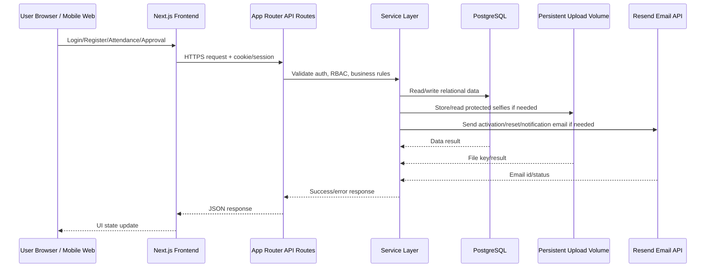
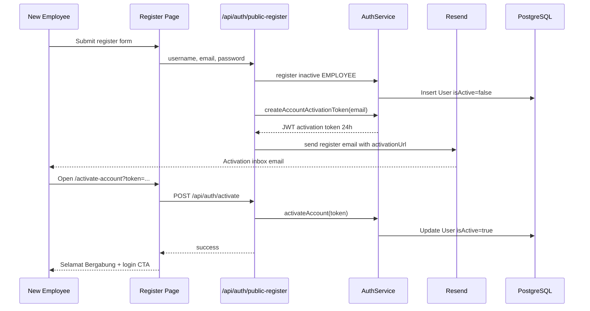
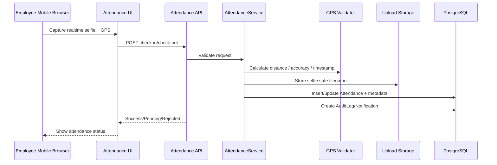
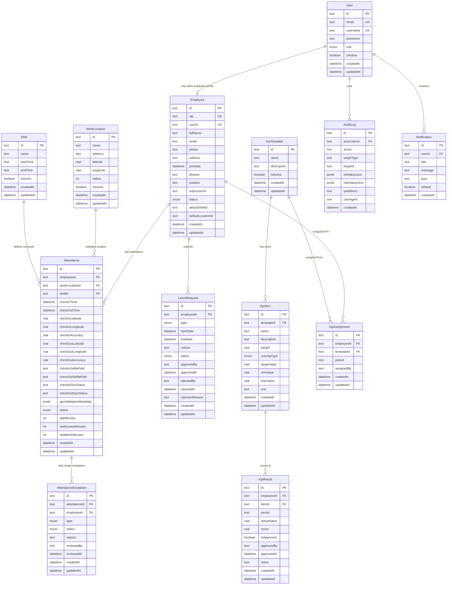
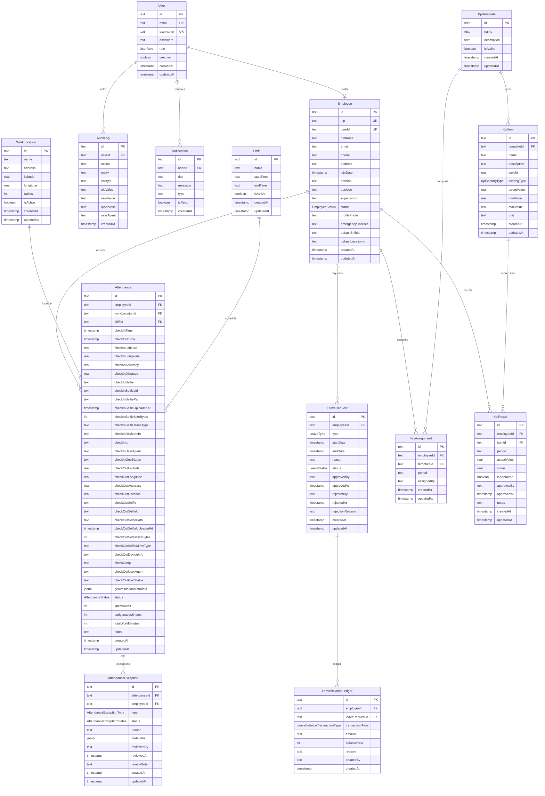
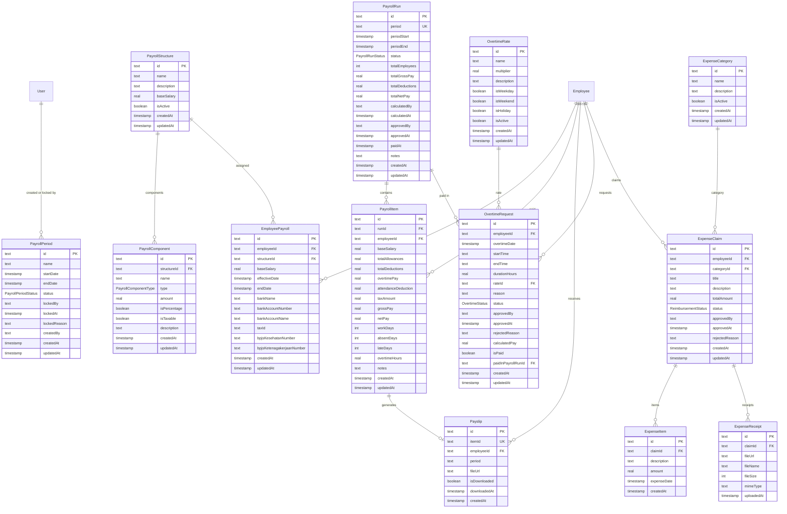
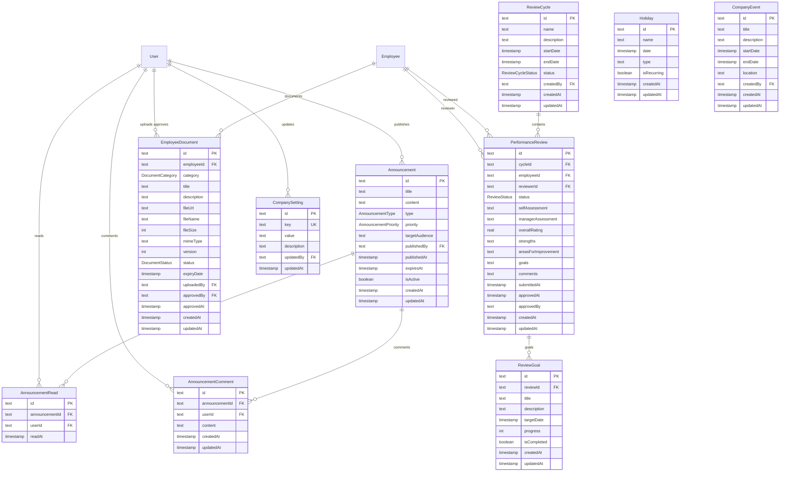

# PRD — MyProdusen Web App

**Project:** MyProdusen HRIS & Employee Operations Web App  
**Client:** Produsen Dimsum Medan  
**Group:** TBM Group  
**Primary Platform:** Web app with mobile-first responsive UI  
**Production Target:** VPS + Coolify + Docker + PostgreSQL  
**Document Status:** Canonical Product Requirements Document  
**Last Updated:** 2026-05-18

---

## 1. Overview

MyProdusen adalah aplikasi internal berbasis web untuk mendigitalkan proses HR,
kehadiran, pengajuan cuti/izin/sakit, KPI, laporan, dan pengelolaan karyawan di
Produsen Dimsum Medan. Sistem ini menggantikan proses manual seperti absensi
kertas, rekap Excel, approval informal, dan pencatatan KPI yang tersebar.

Masalah utama yang diselesaikan:

- Data karyawan tidak terpusat dan sulit dilacak.
- NIP internal perlu dibuat otomatis, unik, dan tidak boleh dipakai ulang.
- Kehadiran perlu validasi GPS, geo-fencing, geo-tagging, dan selfie realtime.
- Pengajuan cuti/sakit/izin butuh workflow approval yang jelas.
- KPI perlu template, assignment, scoring, approval, dan histori.
- Superadmin/HR perlu dashboard, laporan, export, audit log, dan notifikasi.
- File selfie/attachment harus aman, tidak publik, dan tetap ada setelah deploy.
- Deployment harus siap untuk VPS + Coolify dengan PostgreSQL dan persistent volume.

Tujuan utama aplikasi adalah menyediakan sistem HRIS internal yang aman, cepat,
mudah digunakan oleh staf non-teknis, mobile responsive, dan siap produksi.

---

## 2. Requirements

Berikut persyaratan tingkat tinggi untuk sistem MyProdusen.

### 2.1 Aksesibilitas dan Platform

- Aplikasi harus dapat diakses melalui web browser desktop dan mobile.
- UI harus mobile-first karena karyawan memakai HP untuk absensi.
- Desktop tetap optimal untuk Superadmin/Admin HR saat mengelola data dan laporan.
- App harus WCAG-friendly: label jelas, kontras baik, focus state, error state, empty state, dan loading state.
- Bahasa utama UI adalah Bahasa Indonesia.

### 2.2 Pengguna dan Role

Sistem memiliki empat role utama:

| Role | Fungsi Utama |
| --- | --- |
| **Superadmin** | Akses penuh, user management, role, audit log, dashboard global, report, approval penting. |
| **Admin HR** | Kelola karyawan, shift, lokasi kerja, absensi, cuti, KPI HR, report. |
| **Supervisor** | Lihat tim, approve cuti tim, review absensi tim, input/review KPI tim. |
| **Employee / Karyawan** | Absensi GPS + selfie, lihat dashboard pribadi, ajukan cuti/sakit/izin, lihat KPI dan notifikasi. |

Aturan akses wajib:

- Employee hanya melihat data sendiri.
- Supervisor hanya melihat data tim sendiri.
- Admin HR tidak boleh mengakses fitur khusus Superadmin.
- User inactive tidak boleh login.
- Protected API wajib melakukan authorization server-side.

### 2.3 Authentication dan Emailing

- Login menggunakan email/username + password.
- Public register membuat user baru dengan role default `EMPLOYEE` dan status awal inactive.
- Sistem mengirim email aktivasi akun melalui Resend.
- User dapat mengaktifkan akun sendiri melalui link `/activate-account?token=...`.
- Link aktivasi memakai JWT purpose `account-activation` dan masa berlaku 24 jam.
- Setelah aktivasi, akun tersinkron ke `/dashboard/users` untuk review Superadmin.
- Superadmin dapat melihat user yang daftar, status aktif/belum aktif, dan mengatur role.
- Forgot password mengirim link `/reset-password?token=...` dengan token 30 menit.
- Reset password mengirim email konfirmasi password berhasil diubah.
- Email menggunakan brand MyProdusen sesuai reference: yellow `#FFC107`, logo, rounded card, CTA, footer internal by TBM Group.

### 2.4 Data Input

- Data master dikelola lewat form web.
- Absensi membutuhkan input device realtime: GPS, GPS accuracy, timestamp, selfie kamera realtime.
- Selfie absensi tidak boleh upload manual/gallery picker.
- Backend wajib memvalidasi data GPS dan selfie; frontend hanya membantu UX.
- File upload wajib validasi MIME type, ukuran, filename aman, dan lokasi storage persistent.

### 2.5 Data Integrity

- PostgreSQL adalah database produksi.
- Migrations memakai Drizzle SQL migration dan `npm run db:deploy`.
- Tidak boleh reset database produksi.
- Tidak boleh hard delete data historis karyawan, absensi, KPI, audit log.
- Gunakan deactivation/soft-delete behavior untuk data yang punya histori.
- Audit log wajib untuk aksi sensitif.

### 2.6 Deployment

- App harus build sebagai Next.js standalone container.
- Deployment target: VPS + Coolify + Docker.
- PostgreSQL dikelola sebagai service Coolify.
- Upload selfie tersimpan di `/app/uploads` persistent volume.
- Healthcheck tersedia di `/api/health`.
- Env produksi wajib tervalidasi sebelum app start.

---

## 3. Core Features

Fitur inti untuk MVP dan kesiapan produksi.

### 3.1 Landing, Auth, dan Account Activation

1. **Landing Page**
   - Public landing cepat, static, mobile responsive.
   - Brand MyProdusen: logo ayam, kuning, hitam, putih, rounded mobile mockup.
   - CTA ke login/register.

2. **Login**
   - Email/username + password.
   - Rate limit login.
   - Error jelas untuk kredensial salah atau akun belum aktif.
   - Redirect ke dashboard sesuai session.

3. **Register Public**
   - Input username, email, password kuat.
   - Role otomatis `EMPLOYEE`.
   - Status awal inactive.
   - Kirim email aktivasi via Resend.

4. **Email Activation**
   - Email subject: aktivasi akun.
   - CTA: `Aktivasi Akun`.
   - Link: `/activate-account?token=...`.
   - Backend validasi JWT purpose `account-activation`.
   - Jika valid, update `User.isActive=true`.
   - UI menampilkan `Selamat Bergabung` dan link login.

5. **Forgot / Reset Password**
   - `/forgot-password` meminta email.
   - `/reset-password?token=...` membuat password baru.
   - Backend validasi policy password kuat.
   - Kirim email konfirmasi password berubah.

### 3.2 User Management

- Superadmin membuka `/dashboard/users`.
- Lihat semua user terdaftar.
- Lihat status aktif/belum aktif.
- Lihat user yang daftar sendiri.
- Aktifkan/nonaktifkan user.
- Ubah role akses.
- Email dikirim saat role berubah dan saat akun approved.
- Employee placement detail tetap di modul employee.

### 3.3 Employee Management

- Tambah/edit/nonaktifkan karyawan.
- Generate NIP otomatis.
- Assign divisi, posisi, supervisor, shift default, lokasi kerja default.
- Lihat detail karyawan.
- Role user bisa dilihat dan dikoreksi oleh Superadmin.
- Karyawan historis tidak boleh hard delete jika punya histori.

NIP format default:

```txt
MPD-{YEAR}-{DIVISION_CODE}-{SEQUENCE}
```

Contoh:

```txt
MPD-2026-PRD-0001
MPD-2026-PCK-0002
MPD-2026-SLS-0003
```

Aturan NIP:

- Unik.
- Collision-safe.
- Tidak dipakai ulang.
- Stabil setelah employee update.
- Deactivated/resigned employee tetap menyimpan NIP lama.

### 3.4 Work Location dan Geo-fencing

- Kelola lokasi kerja/cabang.
- Field: name, address, latitude, longitude, radiusMeters/status.
- Superadmin/Admin HR dapat create/update/deactivate.
- Employee dapat assigned ke work location.
- Backend menghitung jarak memakai Haversine/reliable distance calculation.
- Perubahan lokasi tidak boleh merusak attendance historis.
- Perubahan lokasi membuat audit log.

### 3.5 Shift Management

- Kelola shift kerja.
- Field: name, startTime, endTime, lateToleranceMinutes, checkinOpenMinutesBefore, checkoutCloseMinutesAfter, status.
- Employee punya default shift.
- Attendance memakai shift aktif.
- Shift change tidak merusak attendance historis.

### 3.6 Attendance GPS + Selfie

Check-in wajib:

- User aktif.
- Employee aktif.
- Shift aktif.
- Work location aktif.
- GPS latitude/longitude.
- GPS accuracy.
- Selfie realtime.
- Backend geo-fence validation.

Check-out wajib:

- Existing check-in.
- Belum check-out.
- GPS latitude/longitude.
- GPS accuracy.
- Selfie realtime.
- Backend geo-fence validation.

Aturan attendance:

- Satu check-in per employee per tanggal.
- Tidak boleh checkout sebelum check-in.
- Tidak boleh double checkout.
- GPS disabled/permission denied harus reject.
- Selfie missing harus reject.
- Outside radius mengikuti config `REJECT_OUTSIDE_GEOFENCE`:
  - `true`: reject.
  - `false`: pending review.
- Outside-radius attempt tetap disimpan untuk audit/exception.
- Hitung late minutes, early leave minutes, total work minutes.
- Manual adjustment wajib reason dan audit log.
- Historical attendance tidak boleh dihapus.

Attendance metadata wajib:

```txt
checkInAt
checkOutAt
checkInLatitude
checkInLongitude
checkInAccuracy
checkOutLatitude
checkOutLongitude
checkOutAccuracy
checkInSelfieUrl
checkOutSelfieUrl
checkInSelfiePath
checkOutSelfiePath
checkInSelfieSizeBytes
checkOutSelfieSizeBytes
checkInSelfieMimeType
checkOutSelfieMimeType
deviceInfo
ipAddress
userAgent
geoValidationMetadata
status
lateMinutes
earlyLeaveMinutes
totalWorkMinutes
```

### 3.7 Attendance Exceptions

- Outside geofence atau bad GPS dapat masuk pending queue.
- Superadmin/Admin HR/Supervisor sesuai permission dapat review.
- Approve/reject exception wajib reason.
- Approval/rejection create audit log dan notification.

### 3.8 Leave / Sick / Permission

Jenis request:

```txt
leave
sick
permission
```

Fitur:

- Employee membuat request sendiri.
- Status awal pending.
- Supervisor/Admin HR/Superadmin approve/reject sesuai permission.
- Rejection wajib reason.
- Overlap active request ditolak.
- Approval/rejection mempengaruhi status attendance.
- Approval/rejection membuat notification dan audit log.
- Leave balance ledger mencatat pergerakan saldo cuti.

### 3.9 KPI Management

KPI mendukung:

- Template.
- Template item.
- Assignment.
- Result.
- Scoring.
- Approval.
- History.

Scoring methods:

```txt
higher_is_better
lower_is_better
boolean
```

Aturan KPI:

- Total weight template idealnya 100.
- Supervisor hanya input/review tim sendiri.
- Employee hanya view KPI sendiri.
- Employee tidak boleh edit skor sendiri.
- KPI approved tidak boleh diedit tanpa role authorized dan reason.
- Edit setelah approval wajib audit log.

### 3.10 Dashboard

Superadmin dashboard menampilkan:

- Total active employees.
- Attendance today.
- Late employees today.
- Leave/sick/permission today.
- Absent employees today.
- Average KPI month.
- Top performers.
- Low performers.
- Attendance trend.
- KPI by division.
- Geo-fence rejected/pending alerts.
- Employee risk alerts.

Employee dashboard menampilkan:

- Status absensi hari ini.
- Shortcut check-in/check-out.
- Jadwal/shift.
- Leave/KPI summary.
- Notifikasi terbaru.

Dashboard wajib respect permission dan tidak leak data lintas role.

### 3.11 Reports dan Export

Required reports:

- Daily attendance report.
- Monthly attendance report.
- Late report.
- Leave/sick/permission report.
- KPI individual report.
- KPI division report.
- Employee performance report.
- Geo-fence rejected/pending report.

Export:

- CSV wajib.
- Excel recommended.
- PDF optional.

Aturan:

- Export respect filters.
- Export respect permissions.
- Supervisor hanya export tim.
- Employee hanya own data jika allowed.
- Export create audit log.
- Selfie tidak diekspor sebagai path/url/binary; cukup flag yes/no.

### 3.12 Notifications

Notifikasi database untuk:

- Leave request submitted.
- Leave approved/rejected.
- KPI assigned.
- KPI approved.
- Attendance rejected/pending due geo-fence.
- Manual attendance adjustment.
- Account activation / role change via email.

User dapat melihat notifikasi sendiri dan mark as read.

### 3.13 Audit Log

Audit wajib untuk:

- Login/logout/failed login jika feasible.
- User create/update/deactivate.
- Role/permission change.
- Account activation.
- Employee create/update/deactivate.
- NIP generation.
- Work location create/update/deactivate.
- Shift create/update/deactivate.
- Attendance check-in/check-out.
- Rejected/pending geo-fence attendance attempt.
- Manual attendance adjustment.
- Leave approval/rejection.
- KPI create/update/approval.
- Report export.
- Selfie protected view.

Audit fields:

```txt
actorUserId
action
targetType
targetId
oldValueJson
newValueJson
ipAddress
userAgent
createdAt
```

Normal user tidak boleh delete audit log.

### 3.14 Payroll, Overtime, Documents, Announcements, Offline Sync

Existing operational modules may exist as extensions/supporting features:

- Payroll periods and locks.
- Overtime rates/requests.
- Reimbursement claims.
- Documents.
- Announcements.
- Offline sync/conflict handling.
- Realtime notifications.

These modules must not weaken HRIS core security rules. Any production expansion
must be documented before scope grows further.

---

## 4. User Flow

### 4.1 Public User Registration and Activation

1. User membuka `/register`.
2. User isi username, email, password kuat.
3. Backend validasi input, rate limit, duplicate email/username.
4. Backend membuat `User` role `EMPLOYEE`, `isActive=false`.
5. Backend membuat JWT activation token purpose `account-activation`, expiry 24h.
6. Backend mengirim email Resend berisi CTA `Aktivasi Akun`.
7. User membuka inbox email dan klik link aktivasi.
8. Frontend `/activate-account?token=...` memanggil `/api/auth/activate`.
9. Backend validasi token dan update `User.isActive=true`.
10. UI menampilkan `Selamat Bergabung` dan CTA login.
11. User login berhasil.
12. Superadmin melihat user aktif di `/dashboard/users` dan dapat koreksi role.
13. Admin HR/Superadmin melengkapi data karyawan di `/dashboard/employees`.

### 4.2 Login / Logout

1. User masuk `/login`.
2. Input email/username dan password.
3. Backend mencari user by email/username.
4. Jika user tidak aktif, tampilkan pesan cek inbox aktivasi atau hubungi Superadmin.
5. Jika password valid dan user aktif, backend set session cookie/JWT.
6. Frontend redirect ke `/dashboard`.
7. Logout menghapus session cookie.

### 4.3 Superadmin User Placement

1. Superadmin login.
2. Buka `/dashboard/users`.
3. Lihat daftar user yang daftar sendiri.
4. Cek status aktif/belum aktif.
5. Set role akses: Employee, Supervisor, Admin HR, atau Superadmin.
6. Jika akun belum aktif, Superadmin bisa aktifkan manual.
7. Role change mengirim email role-changed.
8. Untuk data kerja detail, Superadmin/Admin HR buka employee module.
9. Atur posisi, divisi, supervisor, shift, work location, dan status employee.

### 4.4 Attendance Check-in / Check-out

1. Employee login.
2. Buka dashboard/attendance.
3. App meminta permission kamera dan lokasi.
4. User ambil selfie realtime.
5. App membaca GPS dan accuracy.
6. Frontend mengirim selfie + GPS + metadata ke backend.
7. Backend validasi user/employee/shift/location.
8. Backend hitung jarak dari lokasi kerja.
9. Backend simpan attendance dan file selfie di persistent storage.
10. UI menampilkan success/pending/rejected state.
11. Audit log dan notification dibuat sesuai hasil.

### 4.5 Leave Approval

1. Employee submit leave/sick/permission.
2. Backend cek overlap dan permission.
3. Request masuk pending.
4. Supervisor/Admin HR approve/reject.
5. Jika reject wajib reason.
6. Backend update status, leave balance, notification, audit log.
7. Employee melihat hasil di dashboard/notifikasi.

### 4.6 KPI Workflow

1. Admin HR/Superadmin membuat KPI template.
2. Supervisor/Admin HR assign KPI ke employee/team.
3. Supervisor input/review result.
4. Backend menghitung score sesuai method.
5. Authorized role approve result.
6. Employee melihat KPI pribadi.
7. Edit approved KPI perlu reason dan audit log.

### 4.7 Report Export

1. Authorized user buka report.
2. Pilih filter tanggal/divisi/lokasi/status/employee.
3. Backend resolve scope berdasarkan role.
4. Backend query optimized dan apply row cap.
5. Export CSV dibuat.
6. Audit log export disimpan.
7. UI download file.

---

## 5. Architecture

Arsitektur menggunakan Next.js App Router sebagai frontend dan backend route
handler dalam satu codebase. Business logic berada di service layer. Database
menggunakan PostgreSQL via Drizzle ORM.

### 5.1 High-level Architecture



### 5.2 Activation Flow Architecture



### 5.3 Attendance Flow Architecture



### 5.4 Frontend Architecture

Frontend stack:

- Next.js App Router.
- TypeScript.
- Tailwind CSS.
- Mobile-first responsive layout.
- Internal component patterns for cards, buttons, inputs, alerts, tables, empty states.
- Poppins via `next/font`.
- Lucide icons for consistent iconography.
- Native browser camera/GPS APIs for attendance.

Frontend folder responsibility:

```txt
/app
  public pages: landing, login, register, forgot-password, reset-password, activate-account
  dashboard pages: attendance, employees, users, leave, KPI, reports, profile, etc.
/components
  shared UI and layout components
/features
  feature-oriented business UI/helpers
/lib
  client utilities, auth client, navigation policy, validation helpers
```

Frontend rules:

- Use existing design tokens and brand colors.
- Do not change logo/brand style without explicit request.
- Use loading/error/empty/success states for all data screens.
- Forms must have labels bound to inputs.
- Tappable elements must be mobile-friendly.
- Hide unauthorized actions in UI, but never rely only on frontend guards.

### 5.5 Backend Architecture

Backend stack:

- Next.js App Router route handlers under `/app/api`.
- TypeScript service layer under `src/services` and `lib`.
- Drizzle ORM with PostgreSQL.
- JWT/session auth utilities.
- Zod validation.
- Audit logging.
- Resend transactional email.
- Persistent local storage under `/app/uploads` for production.

Backend rules:

- Route handlers stay thin.
- Business logic belongs in services.
- All protected routes call `requireAuth`.
- All protected routes enforce RBAC server-side.
- Expected errors use consistent response format.
- Never expose private selfies publicly.
- Never commit secrets.
- Avoid heavy dependencies unless documented.

### 5.6 API Response Standard

Use consistent error shape when possible:

```json
{
  "success": false,
  "error": "HUMAN_READABLE_ERROR",
  "message": "HUMAN_READABLE_ERROR"
}
```

Important error codes/messages include:

```txt
AUTH_INVALID_CREDENTIALS
AUTH_USER_INACTIVE
AUTH_FORBIDDEN
EMPLOYEE_NOT_FOUND
NIP_GENERATION_FAILED
ATTENDANCE_ALREADY_CHECKED_IN
ATTENDANCE_NOT_CHECKED_IN
ATTENDANCE_ALREADY_CHECKED_OUT
ATTENDANCE_GPS_REQUIRED
ATTENDANCE_SELFIE_REQUIRED
ATTENDANCE_OUTSIDE_GEOFENCE
LEAVE_OVERLAP
KPI_TEMPLATE_INVALID_WEIGHT
KPI_RESULT_ALREADY_APPROVED
REPORT_EXPORT_FAILED
```

### 5.7 Deployment Architecture

```mermaid
flowchart TD
    GitHub[GitHub main branch] --> Coolify[Coolify App]
    Coolify --> Docker[Docker Build: Next.js standalone]
    Docker --> App[MyProdusen Container]
    App --> Postgres[(PostgreSQL Service)]
    App --> Volume[(Persistent Volume /app/uploads)]
    App --> Resend[Resend Email API]
    App --> Health[/api/health]
```

Production startup:

1. Validate env via `scripts/check-production-env.mjs`.
2. Wait for PostgreSQL.
3. Run `npm run db:deploy`.
4. Optionally bootstrap Superadmin.
5. Start Next.js standalone server.
6. Healthcheck `/api/health`.

---

## 6. Database Schema

Database utama menggunakan PostgreSQL. Nama tabel mengikuti schema Drizzle saat
ini. Diagram berikut merangkum entity utama.



### 6.1 Table Descriptions

| Tabel | Deskripsi |
| --- | --- |
| **User** | Akun login, role, status aktif, credential hash. |
| **Employee** | Profil karyawan, NIP, divisi, posisi, supervisor, shift, lokasi kerja. |
| **WorkLocation** | Lokasi kerja untuk geo-fencing. |
| **Shift** | Jadwal kerja dan status aktif. |
| **Attendance** | Check-in/out, GPS, selfie metadata, status, durasi kerja. |
| **AttendanceException** | Queue review untuk masalah geo-fence/GPS/manual adjustment. |
| **LeaveRequest** | Pengajuan cuti/sakit/izin dan approval state. |
| **LeaveBalanceLedger** | Ledger saldo cuti. |
| **KpiTemplate** | Master template KPI. |
| **KpiItem** | Item KPI, bobot, metode scoring. |
| **KpiAssignment** | Assignment KPI ke employee dan period. |
| **KpiResult** | Nilai aktual, score, approval KPI. |
| **AuditLog** | Catatan aksi sensitif. |
| **Notification** | Notifikasi database untuk user. |
| **PayrollPeriod / PayrollRun / PayrollStructure** | Payroll supporting modules. |
| **OvertimeRate / OvertimeRequest** | Modul lembur. |
| **Document / Announcement / Reimbursement** | Modul operasional pendukung. |


### 6.2 Complete Module ERD

Agar diagram tetap terbaca, ERD lengkap dipecah per domain modul.

#### 6.2.1 Identity, Employee, Attendance, Leave, KPI



#### 6.2.2 Payroll, Overtime, Reimbursement



#### 6.2.3 Communication, Calendar, Performance Review, Documents, Settings



#### 6.2.4 ERD Notes

- Current codebase also contains offline sync/conflict client tables in IndexedDB; those are client-side persistence and are not part of PostgreSQL ERD.
- Some foreign keys are enforced at application/service level even where SQL-level FK constraints are intentionally not declared yet.
- Any new module table must be added to this ERD and `DATABASE.md` before implementation.

### 6.3 Important Indexes and Constraints

Required indexes/constraints:

```txt
User.email UNIQUE
User.username UNIQUE
Employee.nip UNIQUE
Employee.userId UNIQUE
Attendance.employeeId
Attendance.workLocationId
Attendance.status
Attendance.employeeId + checkInDate UNIQUE
Attendance.employeeId + checkInTime DESC
Attendance.status + checkInTime DESC
Attendance.check_in_geo_status
Attendance.check_out_geo_status
Employee.division
Employee.status
WorkLocation.isActive
KpiAssignment.employeeId
KpiAssignment.period
KpiResult.employeeId
AuditLog.actorUserId
AuditLog.createdAt
```

### 6.4 Storage Model

Selfie file path:

```txt
/app/uploads/attendance-selfies/<year>/<month>/<employeeId>/<attendanceId>-{checkin|checkout}.<ext>
```

Database stores:

- Relative storage key/path.
- Protected route URL.
- MIME type.
- Size.
- Uploaded timestamp.

Database does not store binary selfie content.

---

## 7. Design & Technical Constraints

### 7.1 UI/UX Constraints

Approved brand colors:

```txt
Primary Yellow: #FFC107
Accent Red:    #E53935
Black:         #111111
Soft Gray:     #F5F5F5
Success Green: #22C55E
```

Approved style:

- Clean.
- Minimal.
- Professional internal dashboard.
- Modern HRIS mobile app.
- Rounded cards.
- Bottom navigation on mobile.
- Sidebar/navigation on desktop.
- Not AI-looking.
- Easy for non-technical staff.

Rules:

- Do not change logo without explicit request.
- Do not change brand colors without explicit request.
- Do not overuse yellow or red.
- Yellow is CTA/accent.
- Red is danger/reject/late/critical only.
- Preserve reference UI direction from `UI_UX_GUIDE.md` and external design references.

### 7.2 Email UI Constraints

Email must follow reference style:

- Yellow header `#FFC107`.
- MyProdusen logo.
- Rounded white main card.
- Soft cream background.
- Simple icon/hero feel.
- Clear heading and CTA.
- Footer: MyProdusen, by TBM Group, Produsen Dimsum Medan, Medan, Sumatera Utara.
- Tone: ramah, profesional, jelas, singkat, mendukung produktivitas tim.

Required transactional emails:

- Register / activation email.
- Account approved / active email.
- Forgot password email.
- Password changed email.
- Role changed email.
- Notification center email.

Email delivery constraints:

- Resend API key stored only in environment variables.
- Sender domain must be verified in Resend DNS.
- Email failures must not block core mutation unless explicitly required.
- Activation and reset links must be HTTPS in production.

### 7.3 Security Constraints

- Passwords must be hashed.
- Password policy requires strong password.
- JWT secret required and strong in production.
- Inactive user cannot login.
- Protected API must verify auth and permission server-side.
- CSRF/origin checks apply where configured.
- Rate limit login/register.
- Uploaded file must validate MIME and size.
- Uploaded selfie not publicly exposed.
- Use protected selfie routes with authorization.
- Audit log sensitive actions.
- Never commit `.env`, secrets, dumps, or private upload data.

### 7.4 Backend Constraints

- Use TypeScript.
- Use existing stack before adding packages.
- Keep routes thin.
- Put business rules in service layer.
- Validate request body with Zod or existing validators.
- Use PostgreSQL-compatible queries.
- Use additive migrations.
- Never run destructive migration without explicit approval.
- Use indexes for dashboards and reports.
- Do not hard delete historical records.

### 7.5 Frontend Constraints

- Use mobile-first layout.
- Use existing global CSS/design tokens.
- Prefer semantic HTML controls.
- Buttons need disabled/loading states.
- Forms need labels, helper text, and clear errors.
- Dashboards need loading/empty/error/success states.
- Avoid heavy client JavaScript on public landing.
- Static public assets should be optimized and cached.

### 7.6 Testing Constraints

Required test coverage:

- NIP format, uniqueness, sequence, non-reuse.
- Geo-fencing inside/outside/invalid/bad accuracy.
- Attendance check-in/out and duplicate prevention.
- RBAC cross-role access boundaries.
- Inactive user cannot login.
- Account activation token flow.
- Email template content and activation URL.
- KPI scoring.
- Leave overlap and approval/rejection.
- Report export scope and audit logging.

Commands before release:

```bash
npm run lint
npm run test
npm run build
npm run release:migrations
```

Preferred release gate:

```bash
npm run release:check
```

### 7.7 Performance Constraints

- Landing page should be static and fast.
- Use optimized images (`logo-fast.webp`) for public pages.
- Avoid unnecessary hydration on public pages.
- Cache static assets with immutable headers.
- Dashboard/report queries must use indexes.
- CSV export rows capped by `ATTENDANCE_EXPORT_MAX_ROWS`.
- Healthcheck should return quickly and avoid leaking secrets.

### 7.8 Deployment Constraints

Production env required:

```env
DATABASE_URL=
JWT_SECRET=
NEXTAUTH_SECRET=
APP_URL=
NEXT_PUBLIC_APP_URL=
NODE_ENV=production
UPLOAD_DIR=/app/uploads
ATTENDANCE_SELFIE_DIR=attendance-selfies
MAX_UPLOAD_SIZE=
MAX_SELFIE_SIZE_MB=1
GPS_MAX_ACCURACY_METERS=100
DEFAULT_GEOFENCE_RADIUS_METERS=100
REJECT_OUTSIDE_GEOFENCE=true
GPS_TIMESTAMP_MAX_AGE_SECONDS=120
ATTENDANCE_EXPORT_MAX_ROWS=5000
RESEND_API_KEY=
RESEND_FROM_EMAIL=
SUPERADMIN_EMAIL=
SUPERADMIN_PASSWORD=
```

Deployment rules:

- Configure secrets in Coolify, not git.
- Mount persistent volume at `/app/uploads`.
- PostgreSQL backups daily.
- Upload volume backups daily.
- Restore drill quarterly.
- Check `/api/health` after deploy.
- Remove or rotate `SUPERADMIN_*` after first login.

### 7.9 Out of Scope / Phase 2

Phase 2 features must be documented before implementation:

- QR code attendance.
- Face matching selfie.
- Liveness detection.
- Anti-fake GPS detection.
- WhatsApp notification.
- Native mobile app.
- Payroll deep integration.
- Production/inventory sync.
- AI performance insight.

---

## 8. MVP Acceptance Criteria

A release is MVP-ready when all points below pass:

1. User can register, receive email activation, activate account, and login.
2. Superadmin can see registered users at `/dashboard/users` and assign role/status.
3. Employee data can be created with auto-generated NIP.
4. Work location and shift can be configured.
5. Employee can check-in and check-out with GPS + realtime selfie.
6. Backend validates geo-fence and stores selfie metadata securely.
7. Leave/sick/permission request can be created and approved/rejected.
8. KPI template/assignment/result/scoring works with approval rules.
9. Dashboard displays role-appropriate data without leakage.
10. Reports/export work with role scope and audit log.
11. Notifications and audit log are written for sensitive workflows.
12. Docker build works in Coolify.
13. `/api/health` returns healthy after deploy.
14. `npm run release:check` passes.
15. Manual smoke test in `FINAL_CHECKLIST.md` passes.

---

## 9. References

Canonical project docs:

- [`AGENTS.md`](./AGENTS.md)
- [`IMPLEMENTATION_PLAN.md`](./IMPLEMENTATION_PLAN.md)
- [`FINAL_CHECKLIST.md`](./FINAL_CHECKLIST.md)
- [`UI_UX_GUIDE.md`](./UI_UX_GUIDE.md)
- [`ARCHITECTURE.md`](./ARCHITECTURE.md)
- [`DATABASE.md`](./DATABASE.md)
- [`SECURITY.md`](./SECURITY.md)
- [`DEPLOYMENT.md`](./DEPLOYMENT.md)
- [`COOLIFY.md`](./COOLIFY.md)
- [`BACKUP_RESTORE.md`](./BACKUP_RESTORE.md)
- [`REFERENCE_REPO_ANALYSIS.md`](./REFERENCE_REPO_ANALYSIS.md)

External reference material:

- `/Users/macbook/Downloads/contoh_prd.md`
- `/Users/macbook/Downloads/Referencess UI UX MyProdusen/`
- Resend send email docs: `https://resend.com/docs/send-with-nodejs`
- Resend domain verification docs: `https://resend.com/docs/dashboard/domains/introduction`
