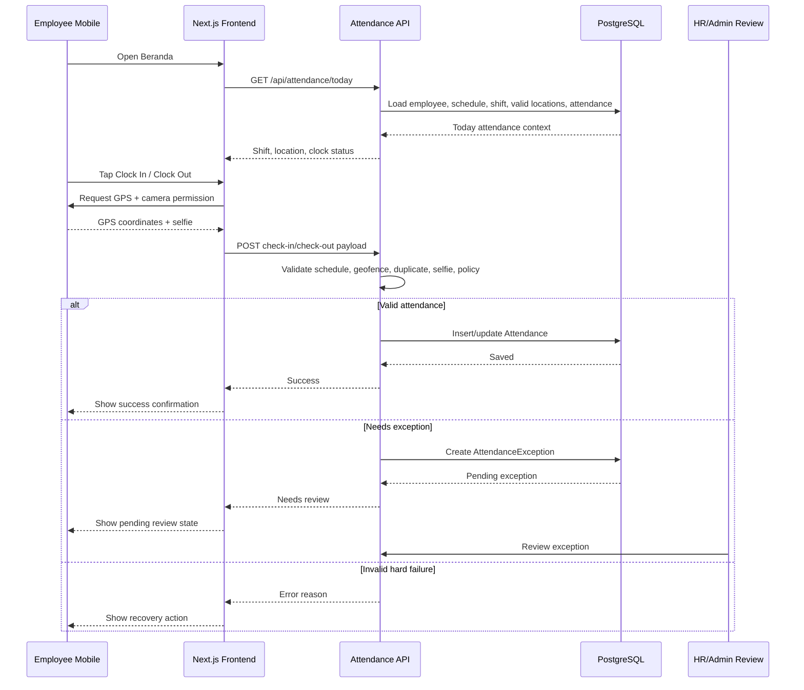
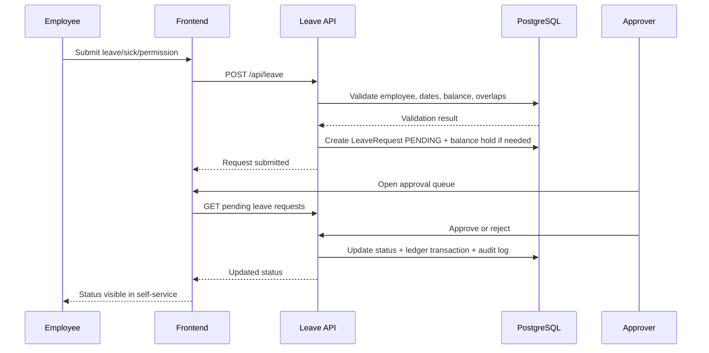
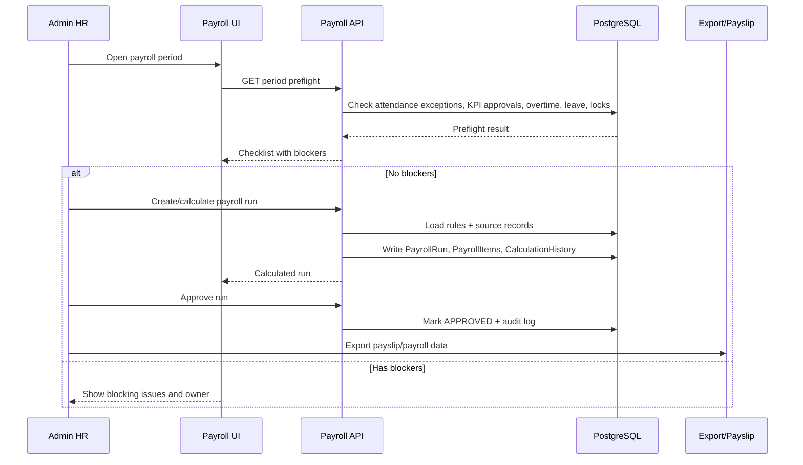
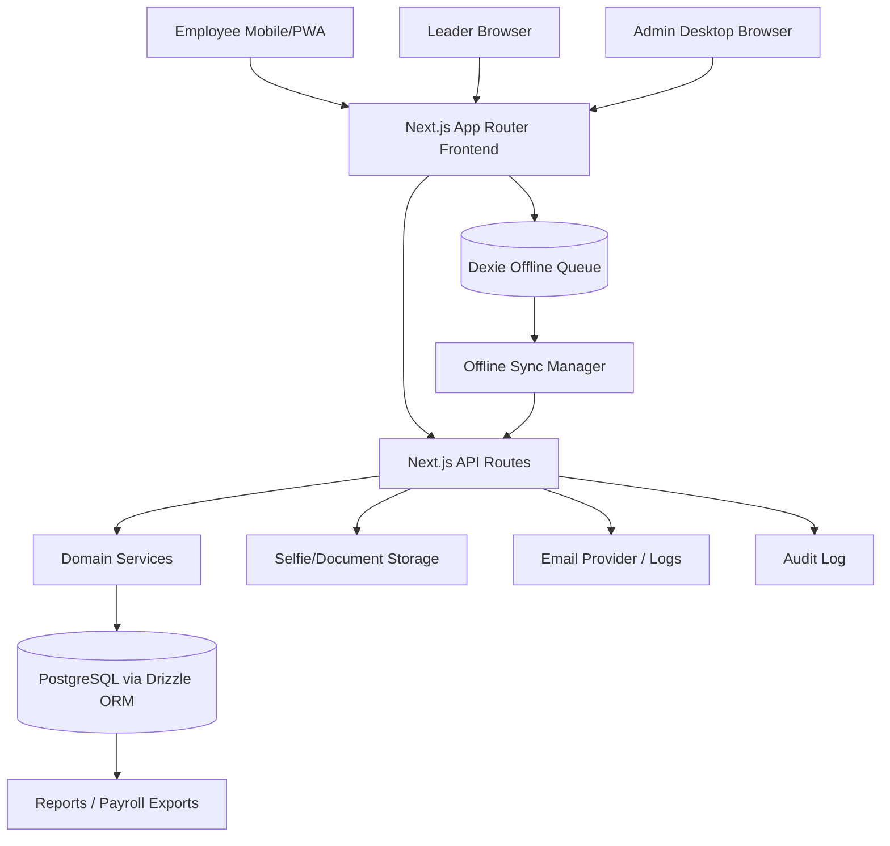

# Product Requirements Document — MyProdusen HRIS

**Product:** MyProdusen  
**Company:** Produsen Dimsum Medan  
**Document owner:** Product & Engineering  
**Document status:** Living PRD / implementation-aligned baseline  
**Last updated:** 2026-06-11  
**Primary codebase:** Next.js HRIS web app with mobile-first employee experience and desktop admin console

---

## 1. Executive Summary

MyProdusen is an internal Human Resource Information System (HRIS) for Produsen Dimsum Medan. It digitizes workforce operations across attendance, leave, overtime, KPI performance, payroll, announcements, documents, reports, audit trails, and employee self-service.

The product serves three operating realities:

1. **Production-floor employees need fast mobile workflows.** Attendance, leave, overtime, profile, payslip, and announcement access must work clearly on phone screens with minimal training.
2. **Leaders and supervisors need structured team controls.** Team assignment, KPI production entry, approval queues, and team reports must be auditable and efficient.
3. **HR/admin teams need operational accuracy at scale.** Employee records, shifts, work locations, payroll periods, rules, reports, and audit logs must reduce manual work and prevent payroll/attendance disputes.

MyProdusen should feel like a modern Silicon Valley-quality internal product: simple employee UX, trustworthy admin console, strong data integrity, measurable workflow outcomes, clean design system, and production-grade release gates.


---

## 2. Requirements Summary

High-level requirements for MyProdusen:

- **Access:** Web browser-first with mobile-first employee flows and desktop-first admin operations.
- **Users:** Multi-role system for `SUPERADMIN`, `ADMIN_HR`, `SUPERVISOR`, `LEADER`, and `EMPLOYEE`.
- **Primary Data Input:** Manual HR/admin input, employee mobile self-service, leader KPI entry, GPS/camera attendance capture, and offline sync queue where safe.
- **Data Specificity:** Attendance must capture schedule, location, GPS, radius, selfie, device, IP/user-agent, and exception metadata. Payroll must trace every calculated amount to source records.
- **Notifications:** Operational alerts appear in dashboard/queues; email logs track outbound notification attempts.
- **Auditability:** Sensitive business actions must generate audit trails.
- **Design Standard:** UI must follow v4 professional HRIS design: Poppins, JetBrains Mono, `#FFC107`, white cards, gray bands, status badges, mobile bottom nav, desktop sidebar.
- **Release Quality:** TypeScript, tests, build, migrations, references, and release gates must pass before deployment.

## 3. Product Vision

Build the operating system for Produsen Dimsum Medan workforce management: one trusted system where every employee action, manager approval, HR decision, and payroll calculation can be captured, validated, audited, and improved.

### Vision Principles

- **Today-first employee experience:** Most employees should complete their primary daily action—attendance—in under 10 seconds.
- **Operational truth over manual reconciliation:** Attendance, schedule, KPI, leave, overtime, and payroll data should converge into one reliable record.
- **Mobile-first where work happens:** Employee workflows must prioritize Android/web mobile usage, GPS, camera, offline awareness, and thumb-friendly interaction.
- **Admin workflows as checklists:** HR operations should expose status, blockers, pending approvals, and next actions rather than raw data dumps.
- **Auditability by default:** Sensitive changes must produce traceable actor, timestamp, before/after, IP/user-agent, and approval metadata.
- **Professional motivation, not childish gamification:** Scores, badges, streaks, and progress indicators must support accountability and clarity without undermining workplace seriousness.

---

## 4. Goals and Non-Goals

### 4.1 Goals

| Goal | Description | Success Metric |
|---|---|---|
| Reduce attendance friction | Employees can clock in/out with GPS and selfie validation from phone | ≥95% successful clock actions completed in <10 seconds after permission grant |
| Improve HR data accuracy | Employee, shift, location, leave, overtime, KPI, and payroll data managed in one system | <1% payroll-impacting attendance records require manual correction after close |
| Create auditable approvals | Leave, overtime, attendance exceptions, KPI approvals, payroll approvals tracked end-to-end | 100% approval actions have actor, timestamp, status, and reason/note where required |
| Speed up payroll preparation | Payroll pulls attendance, KPI, overtime, holidays, and manual adjustments into reviewable runs | HR can generate and review payroll run within one working day after period close |
| Give leaders focused team tools | Leaders manage team KPI production, team employees, and leader reports without full admin access | Leaders complete monthly production KPI submission before payroll cutoff |
| Maintain professional UX quality | UI remains consistent, accessible, responsive, and brand-aligned | Design QA passes before release; no critical mobile layout regressions |

### 4.2 Non-Goals

- Consumer social-network features.
- Public marketplace or external customer ordering workflows.
- General accounting/ERP replacement beyond payroll-adjacent reporting.
- Biometric face recognition unless explicitly scoped with privacy/legal review.
- Multi-company SaaS tenancy unless future commercialization becomes strategic direction.

---

## 5. Target Users and Personas

### 5.1 Employee

**Profile:** Production worker, kitchen staff, delivery/support staff, office employee.  
**Primary device:** Mobile phone.  
**Core jobs:** Clock in/out, view shift/location, submit leave/sick/permission/overtime/correction, view KPI score, read announcements, access payslip/documents, update profile.

**Needs:**
- Clear status: “Am I checked in?”, “Where should I work today?”, “What is my score/payroll status?”
- Minimal typing.
- Strong feedback after submitting action.
- Offline/network status visibility.

### 5.2 Leader / Supervisor

**Profile:** Team lead responsible for production output and team discipline.  
**Primary device:** Mobile + desktop.  
**Core jobs:** View team, input production KPI, monitor attendance exceptions, approve/review where permitted, access team reports.

**Needs:**
- Team-only visibility.
- Fast entry for production metrics.
- Clear pending queue.
- No accidental access to HR-only controls.

### 5.3 Admin HR

**Profile:** HR operator managing daily employee administration.  
**Primary device:** Desktop.  
**Core jobs:** Manage employees, accounts, schedules, shifts, locations, attendance exceptions, leave, overtime, documents, announcements, reports.

**Needs:**
- Bulk-friendly tables.
- Filtering and export.
- Audit history.
- Payroll-impact warnings.

### 5.4 Superadmin

**Profile:** System owner or technical/admin lead.  
**Primary device:** Desktop.  
**Core jobs:** Configure roles, bootstrap/administer accounts, system settings, release/runtime readiness, sensitive operational controls.

**Needs:**
- Full visibility.
- Strong controls around destructive or sensitive actions.
- Production readiness checks.

---

## 6. Product Scope

### 6.1 In Scope Modules

1. Authentication and account lifecycle.
2. Employee profile and HR master data.
3. Attendance with GPS, geofencing, selfie capture, schedules, shifts, and work locations.
4. Attendance exceptions and manual adjustments.
5. Leave, sick, and permission requests with balance ledger.
6. Overtime request, rate, approval, and payroll impact.
7. KPI templates, metrics, assignments, results, production entry, and approvals.
8. Professional gamification and performance score display.
9. Payroll periods, structures, rules, assignments, runs, calculation history, payslips, and export.
10. Teams and leader assignment.
11. Announcements and comments.
12. Documents.
13. Notifications and email logs.
14. Reports: attendance, leave, KPI, employee, PDF/export surfaces.
15. Audit log.
16. Offline/PWA support, sync queue, conflict resolution, and network status visibility.
17. Mobile Android wrapper/live preview support through Capacitor.

### 6.2 Out of Scope for Current Baseline

- Native iOS release.
- Machine-learning workforce forecasting.
- Face recognition or liveness detection beyond selfie evidence capture.
- Automated bank disbursement.
- Integration with external accounting/payroll provider unless scoped separately.

---


## 7. Core User Flows

Bagian ini mengikuti pola PRD operasional: setiap alur menjelaskan aktor, tujuan, langkah utama, validasi sistem, dan output bisnis.

### 7.1 Employee Daily Attendance Flow

1. **Login / Open App:** Employee membuka MyProdusen dari mobile browser/PWA/Android wrapper.
2. **Dashboard Check:** Employee melihat kartu hari ini: shift, lokasi kerja, status GPS, status selfie, dan tombol Clock In/Clock Out.
3. **Permission Grant:** Browser meminta izin lokasi dan kamera bila belum aktif.
4. **Validation:** Sistem membaca koordinat, akurasi GPS, jadwal hari ini, lokasi valid, dan radius geofence.
5. **Selfie Capture:** Employee mengambil selfie sebagai bukti kehadiran.
6. **Submit Clock Action:** Frontend mengirim waktu, koordinat, akurasi, jarak, selfie metadata/file, device info, IP, dan user agent.
7. **Server Decision:** Backend menerima, menolak, atau membuat exception sesuai policy.
8. **Feedback:** Employee melihat sukses, gagal, atau “butuh review” dengan alasan jelas.



### 7.2 Leave / Sick / Permission Flow

1. Employee opens Leave/Pengajuan.
2. Employee selects request type: leave, sick, or permission.
3. Employee enters date range and reason.
4. System validates date range, balance, overlapping requests, and policy.
5. Request enters `PENDING` state.
6. HR/admin/supervisor reviews request.
7. System applies approved/rejected state and updates leave balance ledger.



### 7.3 Payroll Preparation Flow

1. Admin opens payroll period.
2. Admin verifies attendance exceptions, leave, overtime, KPI, holiday/work calendar, and manual adjustments.
3. System runs payroll preflight checklist.
4. Admin creates payroll run.
5. System calculates employee payroll items from rules and source records.
6. Admin reviews variance, exceptions, and totals.
7. Authorized approver approves payroll run.
8. Payroll is exported and then marked paid.



### 7.4 Leader KPI Production Flow

1. Leader opens team KPI input page.
2. System loads only assigned team employees.
3. Leader enters production output per employee/metric/period.
4. System validates metric template, period, scope, and duplicate result.
5. KPI result is saved as draft/submitted and routed for approval if required.
6. Approved KPI contributes to performance score and payroll where configured.

### 7.5 Admin Master Data Setup Flow

1. Superadmin/HR creates user account and employee profile.
2. HR assigns role, division, position, supervisor, default shift, and default location.
3. HR creates shifts and valid work locations.
4. HR assigns schedules and team memberships.
5. Employee can now perform attendance and self-service workflows.

---

## 8. Architecture

### 8.1 High-Level System Architecture



### 8.2 Runtime Components

| Component | Responsibility |
|---|---|
| Next.js App Router | Pages, layouts, route handlers, server/client boundaries |
| React UI | Employee mobile UX, leader pages, admin console |
| Domain services | Attendance, leave, payroll, KPI, overtime, employees, audit business logic |
| Drizzle ORM | Type-safe SQL schema, migrations, relations, indexed queries |
| PostgreSQL | Source of truth for HR, payroll, attendance, KPI, audit data |
| Dexie offline store | Local queue for offline-capable actions and conflict state |
| Workbox service worker | PWA shell caching and network resilience |
| Capacitor Android | Android wrapper/live preview workflow |
| Release scripts | Build, test, migration, environment, and deployment gates |

### 8.3 Request Lifecycle Pattern

```mermaid
flowchart LR
    A[User Action] --> B[Client Validation]
    B --> C[API Route]
    C --> D[Auth + Role Guard]
    D --> E[Zod/Input Validation]
    E --> F[Domain Service]
    F --> G[Database Transaction]
    G --> H[Audit/Notification if needed]
    H --> I[Typed API Response]
    I --> J[UI Toast/State Refresh]
```



### 8.4 Key Engineering Constraints

- All mutations must validate input before service execution.
- Role guard must run server-side, not only via hidden UI navigation.
- Payroll/attendance/leave/overtime mutations that affect money or legal records should use transaction boundaries.
- Sensitive actions must write audit logs in same business operation where practical.
- Report queries must use indexed filters and pagination.
- Offline sync must be idempotent and conflict-aware.

---

## 9. Database Schema

### 9.1 Core ERD

```mermaid
erDiagram
    users ||--|| employees : "linked account"
    employees ||--o{ attendances : "records"
    employees ||--o{ leaveRequests : "submits"
    employees ||--o{ leaveBalanceLedger : "has ledger"
    employees ||--o{ attendanceExceptions : "has exceptions"
    employees ||--o{ overtimeRequests : "submits"
    employees ||--o{ kpiAssignments : "assigned"
    employees ||--o{ kpiResults : "has results"
    employees ||--o{ payrollItems : "paid in"

    workLocations ||--o{ attendances : "validates"
    shifts ||--o{ attendances : "used by"
    shifts ||--o{ employeeSchedules : "assigned"
    employeeSchedules ||--o{ scheduleLocations : "allows"
    workLocations ||--o{ scheduleLocations : "allowed location"
    shifts ||--o{ shiftLocations : "default locations"
    workLocations ||--o{ shiftLocations : "default location"

    kpiTemplates ||--o{ kpiItems : "contains"
    kpiTemplates ||--o{ kpiAssignments : "assigned template"
    kpiItems ||--o{ kpiResults : "measured by"

    payrollPeriods ||--o{ payrollRuns : "contains"
    payrollRuns ||--o{ payrollItems : "contains"
    payrollStructures ||--o{ payrollComponents : "contains"
    payrollRules ||--o{ payrollCalculationHistory : "applied as"

    teams ||--o{ teamEmployees : "has members"
    teams ||--o{ teamLeaders : "has leaders"
    employees ||--o{ teamEmployees : "member of"
    employees ||--o{ teamLeaders : "leads"

    announcements ||--o{ announcementComments : "has comments"
    users ||--o{ auditLogs : "performs"
    users ||--o{ notifications : "receives"
```



### 9.2 Main Tables and Purpose

| Table / Entity | Purpose | Critical Notes |
|---|---|---|
| `User` | Login account, role, active status | Unique email/username; role gates all access |
| `Employee` | HR profile and employment metadata | One-to-one with user; stores NIP, division, position, supervisor, defaults |
| `WorkLocation` | Geofenced worksite | Latitude, longitude, radius, active status |
| `Shift` | Shift policy/time window | Late tolerance, check-in/out windows, special shift flag |
| `EmployeeSchedule` | Employee daily schedule | Unique employee/date schedule assignment |
| `ScheduleLocation` | Valid locations for specific schedule | Enables multi-location schedule override |
| `ShiftLocation` | Default valid locations for shift | Fallback location policy |
| `Attendance` | Clock in/out source of truth | GPS, selfie, device, status, work minutes, adjustment fields |
| `AttendanceException` | Review queue for invalid/edge attendance | Pending/approved/rejected/cancelled state |
| `LeaveRequest` | Leave/sick/permission requests | Approval metadata and rejection reason |
| `LeaveBalanceLedger` | Immutable leave balance history | Entitlement, hold, approval, release, manual adjustment |
| `OvertimeRate` | Overtime pay configuration | Used by approved overtime requests |
| `OvertimeRequest` | Employee overtime workflow | Must be approved before payroll impact |
| `KpiTemplate` | KPI template definition | Container for KPI items |
| `KpiItem` | KPI metric definition | Weight, target, scoring type, unit |
| `KpiAssignment` | KPI template assigned to employee/period | Unique employee/template/period |
| `KpiResult` | Employee KPI measurement | Approval state before final score/payroll use |
| `PayrollPeriod` | Payroll calendar and lock state | OPEN/PREPARING/LOCKED/CLOSED |
| `PayrollStructure` | Salary template | Has payroll components |
| `PayrollComponent` | Allowance/deduction/benefit | Defines payroll item composition |
| `PayrollRun` | Payroll execution for period | DRAFT/CALCULATED/APPROVED/PAID |
| `PayrollItem` | Employee payroll result | Gross/net/components per employee |
| `PayrollRule` | Payroll calculation rule | Sources attendance/KPI/holiday/manual/adjustment |
| `PayrollCalculationHistory` | Reproducibility trail | Explains every calculated amount |
| `Team` | Team grouping | Used for leader scoping |
| `TeamEmployee` | Employee-team membership | Controls team visibility |
| `TeamLeader` | Leader-team assignment | Controls leader scope |
| `Announcement` | Company communication | Admin-published content |
| `AnnouncementComment` | Announcement discussion | Optional interaction layer |
| `Notification` | In-app notification | Read/unread status |
| `EmailLog` | Email delivery trail | Provider status and error metadata |
| `AuditLog` | Sensitive action trail | Actor, action, entity, before/after, IP/user-agent |
| `AttendancePolicy` | Attendance business rules | Scope by company/team/employee |
| `WorkCalendarDay` | Holidays/special workdays | Payroll and attendance impact |

### 9.3 Data Integrity Requirements

- Use unique constraints for identity and period-specific records: user email, username, employee NIP, employee-user link, attendance employee/date, schedule employee/date, KPI assignment/result uniqueness.
- Index all common filters: date, status, employee, period, role, entity, and createdAt.
- Keep ledger/history tables append-oriented: leave balance ledger, payroll calculation history, audit log.
- Never delete payroll-impacting source records without soft-delete, reversal, or audit trail.

---

## 10. Current Implementation Audit

### 16.1 Tech Stack

| Layer | Current Implementation |
|---|---|
| Web framework | Next.js 16 App Router |
| UI | React 19, TypeScript, Tailwind CSS |
| Data fetching | TanStack React Query |
| Database | PostgreSQL via Drizzle ORM |
| Auth/security | JWT, bcryptjs, password policy utilities, rate limiter utilities |
| Offline/PWA | Workbox, Dexie, offline sync manager, network detector, service worker registration |
| Mobile | Capacitor Android scripts/live preview support |
| Testing | Vitest, Playwright, TypeScript compile gate |
| Release gates | lint, test, build, migration checks, reference checks, env checks, release gate script |

### 16.2 Implemented App Surfaces Observed

Employee-facing and shared surfaces:
- Login, register, activate account, forgot password, reset password.
- Dashboard home / Beranda.
- Attendance clock/capture/success.
- Leave and request pages.
- Overtime page.
- Payroll self-service page.
- Profile, password, notifications, about.
- Announcements and announcement detail.
- Documents.
- Offline indicators, sync status, sync queue, conflict resolver.

Admin/HR surfaces:
- Employees and employee detail.
- Accounts/users.
- Attendance overview, schedules, exceptions, overtime.
- Shifts.
- Locations with map/form/filter/delete components.
- Leave and leave balance.
- KPI, KPI templates, KPI results.
- Payroll, payroll run detail, payroll structures.
- Reports, attendance reports, PDF reports.
- Audit log.
- Settings.
- Announcements.

Leader surfaces:
- Team dashboard.
- KPI production input.
- Leader reports.

### 16.3 Implemented API Domains Observed

- `auth`: public register, activation, reset/forgot password, change password, resend activation, public register token.
- `attendance`: today, check-in, check-out, validation, policies, schedules, shift locations, exceptions, adjustment.
- `leave`: requests, approvals, rejections, settings, balance, balance history.
- `overtime`: requests, approval/rejection, rates.
- `payroll`: periods, structures, assignments, rules, runs, calculation, approval, paid/unpaid status, export, payslips, employee self-service salary rule.
- `kpi`: metrics, assignments, targets, results, templates, production self-service.
- `teams`: team management, leader assignment, employee assignment.
- `employees` and `users`: profile/role management.
- `announcements`: CRUD and comments.
- `documents`.
- `reports`: attendance, summary, employees, leave, KPI, PDF.
- `dashboard`: stats and heatmap.
- `audit`.
- `work-calendar`.

### 16.4 Data Model Coverage Observed

Core schemas include:
- Users and employees with role, status, supervisor, default shift, and default location.
- Work locations with latitude, longitude, radius, active flag.
- Shifts, employee schedules, schedule locations, shift locations.
- Attendance records with check-in/out GPS, accuracy, distance, selfie metadata, device info, IP, user agent, geostatus, late/early/work minutes, manual adjustment fields.
- Attendance exceptions with type/status/review metadata.
- Leave requests and leave balance ledger.
- KPI templates, KPI items, KPI assignments, KPI results.
- Audit logs, notifications, email logs.
- Payroll periods, structures, components, runs, items, rules, calculation history.
- Overtime rates and overtime requests.
- Teams, leader assignments, and related team membership concepts.
- Announcements and comments.
- Attendance policies and work calendar days.

### 16.5 Strengths

- Broad end-to-end HRIS surface already exists.
- Strong attendance model with geofence, selfie, schedule, location, and exception concepts.
- Payroll domain goes beyond simple payslip display and includes periods, rules, runs, approval, export, and history.
- Release scripts show production-readiness mindset.
- Offline/PWA foundation exists for field/mobile reliability.
- v4 design system establishes consistent visual direction.
- Role model includes `SUPERADMIN`, `ADMIN_HR`, `SUPERVISOR`, `LEADER`, `EMPLOYEE`.

### 16.6 Product and Engineering Gaps to Prioritize

| Gap | Impact | Recommendation |
|---|---|---|
| PRD previously too thin | Product intent and acceptance criteria unclear | Use this PRD as baseline for roadmap and release QA |
| Role permissions need explicit matrix | Risk of accidental over/under-permission | Maintain permission matrix in product and code; test each role route/API |
| Offline behavior needs crisp business rules | Duplicate/late/conflicting attendance data risk | Define sync conflict policy per entity and audit every server reconciliation |
| Payroll correctness depends on cross-module data quality | Payroll disputes if attendance/KPI/overtime states unclear | Add payroll preflight checklist and blocking validations before approval |
| Gamification can feel unserious if overdone | Employee trust risk | Keep professional, transparent, limited badges, score explainability |
| Reporting requirements need KPI definitions | Reports may not answer management questions | Define report catalog, owners, filters, export formats, and SLAs |
| Privacy/security requirements need explicit policy | Selfie/GPS/payroll data are sensitive | Add retention, access, masking, and audit rules before broader rollout |

---

## 11. Functional Requirements

### 16.1 Authentication and Account Lifecycle

#### Requirements

- Support login via username/email and password.
- Support public registration where enabled by token/configuration.
- Support account activation flow.
- Support forgot-password and reset-password flow.
- Support password change for authenticated users.
- Support resend activation.
- Store passwords using secure hashing.
- Enforce active/inactive account status.
- Apply rate limiting and secure error handling to auth endpoints.

#### Acceptance Criteria

- User cannot access dashboard without valid authenticated session.
- Inactive user cannot perform authenticated business actions.
- Password reset token cannot be reused after completion or expiry.
- Auth errors do not reveal whether email/username exists unless product explicitly allows it.
- Activation state is visible enough for HR/admin support.

---

### 16.2 Roles and Permissions

#### Roles

| Role | Purpose |
|---|---|
| `SUPERADMIN` | Full system administration and sensitive configuration |
| `ADMIN_HR` | HR operations, employee records, approvals, reports, payroll workflows |
| `SUPERVISOR` | Supervisory review, team visibility, approval support where configured |
| `LEADER` | Team-level operations, production KPI entry, team reports |
| `EMPLOYEE` | Self-service only |

#### Requirements

- Enforce role checks on both UI navigation and API handlers.
- Hide unavailable navigation items based on role.
- Prevent direct URL/API access to unauthorized resources.
- Scope leader/supervisor data to assigned teams/subordinates.
- Audit role changes.

#### Acceptance Criteria

- `EMPLOYEE` cannot access admin, payroll admin, audit, or employee management APIs.
- `LEADER` can only view and act on assigned team scope unless granted explicit expanded permission.
- Role change creates audit log with old role, new role, actor, and timestamp.
- Permission tests cover key API and page routes for each role.

---

### 16.3 Employee Profile and HR Master Data

#### Requirements

- Manage employee identity: NIP, full name, email, phone, address.
- Manage employment data: join date, division, position, training status, training end date, supervisor, status.
- Manage profile photo and emergency contact.
- Assign default shift and default location.
- Link employee record to user account.
- Support employee self-service profile view/edit where allowed.

#### Acceptance Criteria

- NIP is unique.
- User-to-employee relationship is one-to-one.
- Inactive/suspended employees do not appear as valid active attendance actors unless explicitly allowed.
- HR can filter employees by status, division, position, and supervisor.

---

### 16.4 Attendance

#### Requirements

- Employee can view today’s attendance state: shift, location, GPS status, clock-in/out status.
- Employee can clock in with GPS latitude/longitude, GPS accuracy, distance from valid work location, selfie, device info, IP, and user agent.
- Employee can clock out with equivalent validation and evidence.
- System validates work location radius and schedule/shift assignment.
- System supports multiple valid locations per schedule and default valid locations per shift.
- System computes late minutes, early leave minutes, total work minutes, and attendance status.
- System prevents duplicate attendance for same employee/date.
- System exposes attendance heatmap and dashboard stats.
- Admin can view, filter, export, and adjust attendance records.

#### Acceptance Criteria

- Employee can identify today’s shift/location within 3 seconds on Beranda.
- Primary clock CTA is thumb-accessible on mobile.
- Clock-in requires selfie and GPS unless policy/exception allows bypass.
- Duplicate same-day check-in is rejected or routed into safe recovery flow.
- Location validation response states inside/outside radius, distance, and accuracy quality.
- Manual adjustment requires reason and actor and creates audit log.

---

### 16.5 Attendance Exceptions

#### Requirements

- Support exception types: `OUTSIDE_GEOFENCE`, `BAD_GPS_ACCURACY`, `MISSING_SELFIE`, `MANUAL_ADJUSTMENT`, `LATE_CORRECTION`, `MISSING_CHECKOUT`.
- Employee/admin can create exception request where business rules allow.
- Reviewer can approve/reject/cancel exception with note.
- Exception status affects downstream payroll only after approved state where relevant.

#### Acceptance Criteria

- Pending exception appears in reviewer queue.
- Approval/rejection records reviewer, timestamp, and note if required.
- Rejected exception does not silently alter attendance/payroll state.
- Employee can see request status and outcome.

---

### 16.6 Schedules, Shifts, and Work Locations

#### Requirements

- Admin can create/update/deactivate shifts.
- Shift includes name, start time, end time, late tolerance, check-in open window, checkout close window, special-shift flag.
- Admin can create/update/deactivate work locations with name, address, coordinates, and radius.
- Admin can assign per-day employee schedules.
- Admin can attach one or more valid work locations to schedule.
- Shift can have default valid locations.

#### Acceptance Criteria

- Inactive location/shift cannot be newly assigned unless explicitly allowed.
- Schedule assignment conflicts are prevented by employee/date uniqueness.
- Employee attendance resolves valid location from schedule override first, then shift default, then employee default as configured.
- Location map/form validates coordinate and radius input.

---

### 16.7 Leave, Sick, and Permission

#### Requirements

- Employee can submit leave/sick/permission request with type, start date, end date, and reason.
- Admin/authorized reviewer can approve or reject with rejection reason where required.
- Leave balance ledger tracks entitlement, carry forward, holds, approvals, rejected release, manual adjustment, and expiry.
- Employee can view leave balance and balance history.
- Admin can configure leave settings.

#### Acceptance Criteria

- Request date range cannot be invalid (`endDate < startDate`).
- Approved leave updates attendance/payroll-impacting state according to policy.
- Rejected leave releases held balance.
- Leave balance history is immutable ledger-style, not overwritten summary only.

---

### 16.8 Overtime

#### Requirements

- Employee can submit overtime request.
- Reviewer can approve/reject/cancel request.
- Admin can configure overtime rates.
- Approved overtime becomes payroll calculation input.
- Overtime records maintain employee, date/time/duration, reason, status, reviewer metadata, and rate reference where applicable.

#### Acceptance Criteria

- Overtime cannot affect payroll until approved.
- Rejection requires visible reason.
- Payroll run displays overtime contribution separately from base salary and other components.

---

### 16.9 KPI and Performance

#### Requirements

- Admin can create KPI templates and items.
- KPI items support scoring type: `HIGHER_IS_BETTER`, `LOWER_IS_BETTER`, `BOOLEAN`.
- KPI items support weight, target, min/max, and unit.
- Admin can assign KPI templates to employees and periods.
- KPI results store actual value, calculated score, approval status, notes, approver, and approval timestamp.
- Leader can input production KPI for assigned team scope.
- Employee can view approved KPI/performance score.

#### Acceptance Criteria

- KPI assignment uniqueness enforced by employee/template/period.
- KPI result uniqueness enforced by employee/item/period.
- Unapproved KPI result is visually distinct and excluded from final employee score/payroll where required.
- Leader cannot submit KPI for employees outside assigned scope.

---

### 16.10 Professional Gamification System

#### Score Model

- Attendance / Kehadiran: 30%.
- Production KPI: 50%.
- Behavior / Perilaku Kerja: 20%.
- Every new employee starts at 100.
- Display formula: `score / 10` for readable 10-point presentation.
- Badges remain professional and maximum 3–5 visible.

#### Requirements

- Show score as secondary context, never as primary attendance action.
- Explain score drivers in plain language.
- Avoid childish visuals, lottery mechanics, or shaming patterns.
- Support streaks and badges only where business meaning is clear.

#### Acceptance Criteria

- Employee can understand why score changed.
- Score display never blocks attendance action.
- Gamification UI follows professional HR tone.

---

### 16.11 Payroll

#### Requirements

- Admin can define payroll periods with date range, status, lock/close controls, creator, and close metadata.
- Admin can define payroll structures and components: allowance, deduction, benefit.
- Admin can assign payroll structures/rules to employees or segments.
- Payroll rules can source from attendance, KPI, holidays, manual adjustment, or configured formulas.
- Admin can create payroll runs per period.
- Payroll run can be calculated, reviewed, approved, marked paid/unpaid, and exported.
- Payroll item stores employee-level gross/net/components and calculation metadata.
- Employee can view own payslip/payroll information where released.
- Payroll calculation history records source type, source ID, rule ID, amount, description, and metadata.

#### Acceptance Criteria

- Payroll period cannot be approved with unresolved required blockers: pending attendance exceptions, unapproved KPI inputs, pending overtime, unlocked/invalid period state.
- Payroll approval requires authorized role.
- Approved payroll cannot be recalculated without explicit unlock/reversal flow.
- Employee only sees own payslip.
- Export matches approved payroll run totals.
- Payroll run status transitions follow: `DRAFT` → `CALCULATED` → `APPROVED` → `PAID`.

---

### 16.12 Teams and Leader Workflows

#### Requirements

- Admin can create/manage teams.
- Admin can assign leaders to teams.
- Admin can assign employees to teams.
- Leader sees assigned team members and team reports.
- Leader can submit production KPI for assigned team scope.

#### Acceptance Criteria

- Team assignment changes are auditable.
- Leader has no cross-team visibility by default.
- Removing employee from team revokes leader access on next request/session refresh.

---

### 16.13 Announcements and Notifications

#### Requirements

- Admin can create, publish, update, and delete announcements.
- Employees can view announcements relevant to them.
- Announcement detail supports comments where enabled.
- Notifications capture title, message, type, read/unread state, and timestamp.
- Email logs store template, recipient, subject, provider, status, error, and metadata.

#### Acceptance Criteria

- Unread notification count is visible.
- Employee can mark notifications read.
- Failed email is logged with error details without exposing secret provider credentials.

---

### 16.14 Documents

#### Requirements

- Admin can manage document records/files for employees or company use.
- Employee can view documents permitted to them.
- Document access should respect role and ownership.

#### Acceptance Criteria

- Employee cannot access another employee’s private document.
- Document actions are auditable when sensitive.

---

### 16.15 Reports and Exports

#### Required Reports

| Report | Primary Users | Key Filters |
|---|---|---|
| Attendance detail | HR/Admin, Supervisor | Date range, employee, status, location, division |
| Attendance summary | HR/Admin | Period, division, status, exception state |
| Leave report | HR/Admin | Date range, type, status, employee |
| KPI report | HR/Admin, Leader | Period, template, employee, team, approval status |
| Employee report | HR/Admin | Status, division, position, join date |
| Payroll export | HR/Admin | Period, run status |
| Leader team report | Leader | Team, period, employee |

#### Acceptance Criteria

- Reports are filterable and exportable where business needs require.
- Exported totals match on-screen totals.
- Reports respect role scope.
- Large reports avoid blocking normal app usage.

---

### 16.16 Audit Log

#### Requirements

- Store user ID, action, entity, entity ID, old value, new value, IP address, user agent, timestamp.
- Log sensitive actions: role change, payroll approval, payroll unlock, attendance adjustment, exception review, leave approval/rejection, overtime approval/rejection, employee status change, configuration changes.
- Admin can filter audit logs by actor, entity, action, and time.

#### Acceptance Criteria

- Audit log is append-only from product perspective.
- Sensitive operation without audit log is release-blocking defect.

---

### 16.17 Offline and PWA

#### Requirements

- App exposes network/offline state.
- Offline-capable actions are queued locally via Dexie/sync manager where safe.
- Sync queue shows pending, success, failure, and conflict states.
- Conflict resolver handles server/client divergence.
- Service worker enables app shell reliability.

#### Attendance Offline Policy

- Offline attendance may be captured locally with timestamp, selfie, coordinates, and device metadata if business enables it.
- Server must validate submission timestamp, location data, duplicate state, and stale window on sync.
- Offline attendance requiring exception must be routed to review queue, not silently approved.

#### Acceptance Criteria

- User knows when action is queued, synced, failed, or needs review.
- Sync conflicts never overwrite approved server records silently.
- Offline queue survives page reload.

---

## 12. UX and Design Requirements

### 16.1 Design System

- Accent: `#FFC107` yellow.
- Default radius: `8px`.
- Background: soft gray bands.
- Cards: white surfaces, flat style, hairline border.
- Typography: Poppins for UI/headings; JetBrains Mono for stat numbers.
- Components: bold CTAs, tinted status badges, compact tables, clear empty states.

### 16.2 Employee Mobile UX

#### Requirements

- Phone-first layout.
- Bottom navigation.
- Beranda starts with greeting, stats row, and attendance CTA.
- Attendance card clearly shows shift, location, GPS, clock status, and action.
- Gamification/score visible but secondary to attendance.
- Status messages use color + text, not color alone.

#### Acceptance Criteria

- Employee can identify today’s shift/location within 3 seconds.
- Clock In/Out CTA is primary and thumb-accessible.
- Critical errors provide recovery action.
- Loading states prevent duplicate submission.

### 16.3 Admin Desktop UX

#### Requirements

- Desktop white sidebar with yellow active state.
- Dashboard metrics use mono numbers.
- Data tables use compact uppercase headers.
- Status uses badges.
- Management cards remain white/flat.
- Tables support responsive fallback to cards or horizontal scroll on tablet/mobile.

#### Acceptance Criteria

- Admin can scan operational counts quickly.
- Active navigation location is obvious.
- Tables remain readable on desktop and usable on smaller screens.
- Approval flows show status timeline/checklist.

### 16.4 Accessibility

- Text contrast must meet WCAG AA for core UI.
- Color cannot be sole status signal.
- Inputs must have labels or accessible names.
- Buttons must show disabled/loading state.
- Keyboard navigation must work for admin table actions and modal flows.

---

## 13. Data and Privacy Requirements

### 16.1 Sensitive Data

Sensitive data includes:
- Password hashes and auth tokens.
- Employee personal data: phone, address, emergency contact, profile photo.
- GPS coordinates, location validation metadata, IP address, user agent.
- Selfie images and selfie metadata.
- Payroll data and payslips.
- Audit logs.

### 16.2 Requirements

- Apply least-privilege access to sensitive data.
- Mask or avoid exposing unnecessary PII in list/table views.
- Protect payroll endpoints with strict role checks.
- Store file paths/URLs safely; never expose internal storage details unnecessarily.
- Define retention policy for selfies, GPS metadata, email logs, and audit logs.
- Avoid logging secrets, raw passwords, tokens, or full payroll payloads in application logs.

### 16.3 Acceptance Criteria

- Employee cannot query another employee’s payroll/private profile/selfie data.
- Admin access to sensitive employee data is scoped by role.
- Security review passes before production rollout of selfie/GPS/payroll modules.

---

## 14. Non-Functional Requirements

### 16.1 Performance

- Dashboard initial usable state target: <2.5 seconds on typical company mobile network after warm cache.
- Attendance clock action API target: p95 <1.5 seconds excluding image upload/network variability.
- Admin tables must paginate/filter server-side for large datasets.
- Reports should use efficient indexed queries and avoid full-table scans for common filters.

### 16.2 Reliability

- Attendance and payroll writes must be transactional where multiple records change together.
- Payroll calculations must be reproducible from source records and calculation history.
- Background/retry operations must be idempotent where possible.
- Failed external email/file operations must not corrupt core HR records.

### 16.3 Security

- JWT secret and database URL required in production env checks.
- Cookies/security settings must be production-safe.
- CSRF/rate-limit bypass flags only allowed in test mode.
- Input validation via Zod or equivalent on all mutation APIs.
- File upload validation must enforce size and MIME policies.

### 16.4 Maintainability

- TypeScript compile gate must pass.
- Unit tests for payroll, attendance validation, date handling, KPI calculation, permissions.
- E2E smoke tests for login, employee attendance, leader KPI input, admin payroll flow.
- Release gate: `npm run release:check` before deployment.

---

## 15. Analytics and Success Metrics

### 16.1 Operational Metrics

- Daily active employees / expected scheduled employees.
- Clock-in success rate.
- Clock-out completion rate.
- Average clock-in completion time.
- Attendance exception rate by type.
- Pending approval aging by queue.
- Leave balance discrepancy count.
- Payroll run cycle time from period close to approval.
- Payroll recalculation count after approval.
- KPI submission completion rate before cutoff.

### 16.2 Product Quality Metrics

- Mobile crash/error rate.
- API error rate by module.
- p95 latency for attendance and payroll endpoints.
- Failed sync queue count.
- Role-based access denial attempts.
- Release gate pass/fail trend.

---

## 16. Release Criteria

### 16.1 Required Commands

```bash
npm run lint
npm run test
npm run build
npm run release:check
```

### 16.2 Production Runtime Checks

```bash
npm run release:env
npm run db:deploy
npm run seed:work-location
```

### 16.3 Release Blockers

- Any TypeScript compile error.
- Failing payroll calculation tests.
- Failing attendance/geofence validation tests.
- Unauthorized access to admin/payroll/audit endpoints by employee role.
- Missing audit log on sensitive action.
- Payroll approval possible with unresolved blocking states.
- Clock-in/out duplicate or data-loss defect.
- Critical mobile layout regression on employee attendance flow.

---

## 17. Roadmap Recommendations

### Phase 1 — Stabilize Core HRIS

- Finalize role-permission matrix and enforce with tests.
- Harden attendance validation and exception flows.
- Add payroll preflight checklist.
- Complete report catalog with owners and acceptance criteria.
- Add privacy/retention policy for GPS, selfies, and payroll data.

### Phase 2 — Operational Excellence

- Improve offline sync conflict UX.
- Add bulk schedule import/export.
- Add approval inbox across leave/overtime/exceptions/KPI/payroll.
- Add dashboard widgets for operational blockers.
- Add payroll variance report vs prior period.

### Phase 3 — Intelligence and Automation

- Attendance anomaly detection.
- Payroll anomaly detection.
- KPI trend insights for leaders.
- Workforce planning views.
- Optional integrations with accounting/bank/export systems.

---

## 18. Open Questions

1. What is official payroll cutoff schedule and who owns final approval?
2. Should offline attendance be allowed in production, or only exception-request capture?
3. What selfie/GPS retention period is legally and operationally acceptable?
4. Which roles can approve leave, overtime, attendance exceptions, KPI results, and payroll?
5. Should supervisors and leaders share same permission scope or remain distinct?
6. What exact formula maps attendance/KPI/behavior to final payroll-impacting score?
7. Which documents are company-wide vs employee-private?
8. Should employees see raw score components or only summarized score explanation?
9. What export formats are mandatory for finance: CSV, XLSX, PDF, or all?
10. Is MyProdusen intended to remain internal-only or eventually become SaaS product?

---

## 19. Appendix: Current Key Files and Commands

### 19.1 Key Files

- `README.md` — project overview and v4 UI notes.
- `package.json` — scripts, dependencies, release gates.
- `drizzle/schema.ts` — database schema and relations.
- `app/api/**/route.ts` — API handlers.
- `app/dashboard/**/page.tsx` — dashboard pages.
- `src/services/**` — domain services.
- `src/components/**` — UI/domain components.
- `src/hooks/offline/**` and `lib/offline/**` — offline sync support.
- `app/globals.css` — v4 design token/component styling.
- `src/components/dashboard/EmployeeBeranda.tsx` — employee home/attendance entry surface.

### 19.2 Important Scripts

```bash
npm run dev
npm run lint
npm run test
npm run build
npm run release:check
npm run db:generate
npm run db:migrate
npm run db:deploy
npm run e2e
npm run e2e:staging
npm run android:live
npm run cap:sync
```

---

## 20. Definition of Done

Feature is done when:

1. Requirements and acceptance criteria are implemented.
2. API and UI enforce correct role scope.
3. Inputs are validated and errors are user-actionable.
4. Sensitive action creates audit log.
5. Mobile and desktop responsive behavior pass QA for relevant persona.
6. Unit/E2E tests cover critical happy path and failure path.
7. Release gates pass.
8. Documentation and PRD are updated if product behavior changes.

---

## 21. Product Quality Bar

MyProdusen should feel reliable enough that HR can close payroll from it, simple enough that production employees use it without training, and auditable enough that disputes can be resolved from system records instead of chat screenshots or spreadsheets.
